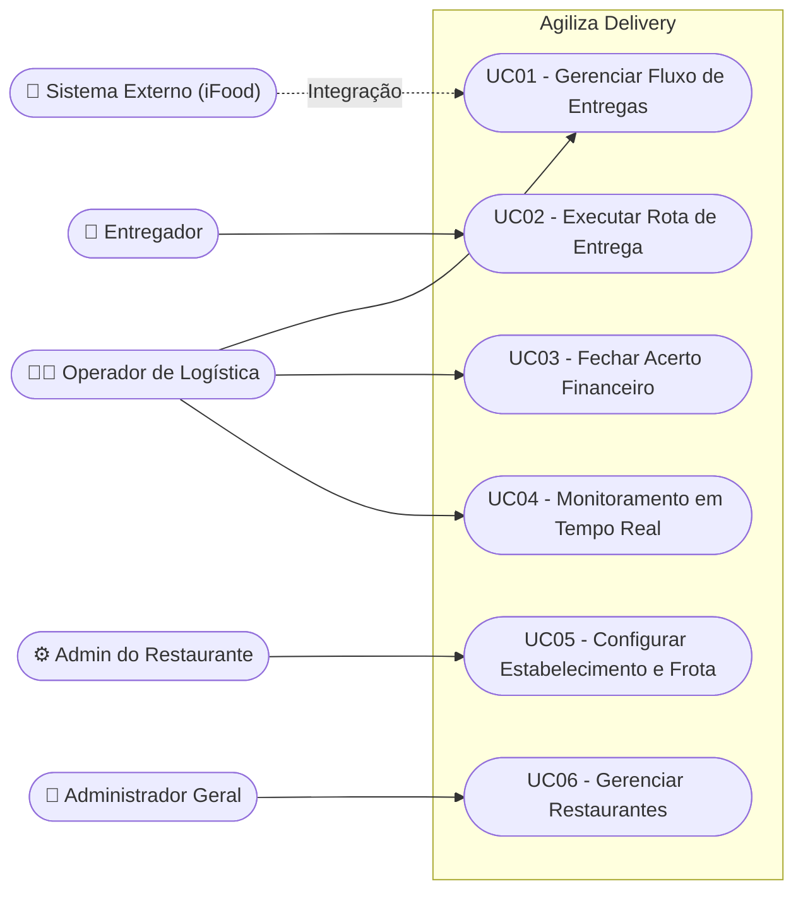
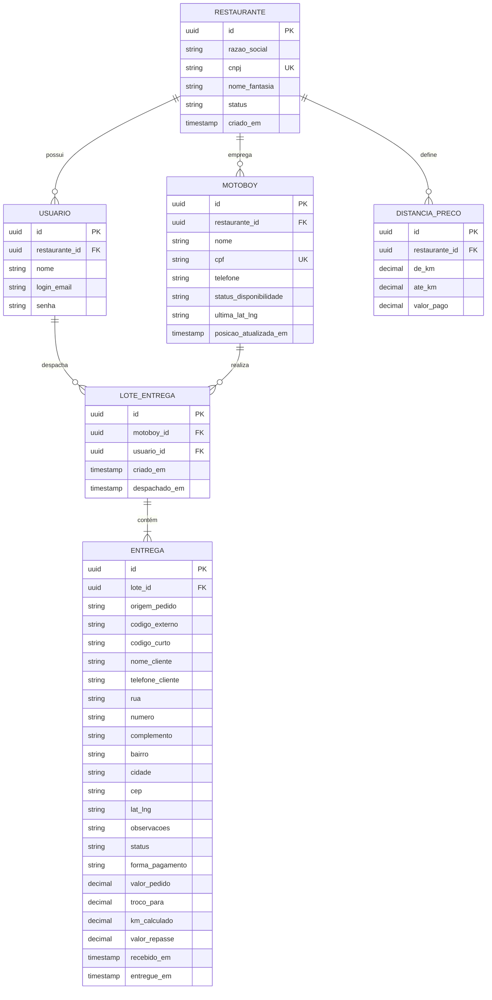

# DOCUMENTO DE VISÃO DO PRODUTO - DVP
**Projeto:** Agiliza Delivery
**Aluno:** Eduardo dos Santos de Camargo
**Ano:** 2026

---

## 1. REQUISITOS

### 1.1 Fundamentação dos Requisitos
#### 1.1.1 Técnicas Utilizadas para Requisitos
*   Entrevistas e reuniões com stakeholders (Gestores de Restaurantes).
*   Análise de Documentos (Planilhas de acerto financeiro atuais).
*   Brainstorming para definição de arquitetura de integração (iFood).
*   Prototipação conceitual (User Stories / Casos de Uso).

### 1.2 Concepção dos Requisitos
#### 1.2.1 Identificação do Domínio
O **Agiliza Delivery** é uma plataforma que atua como o sistema nervoso central da logística de entregas para restaurantes com frota própria. O problema atual é a gestão "cega" da frota, o acerto financeiro manual e empírico de quilometragem, e a perda de tempo na digitação e agrupamento de pedidos.
A plataforma propõe um ecossistema descentralizado composto por: um aplicativo móvel impositivo (Flutter) para motoboys (rastreamento e marcação de status), um Backoffice Web para o operador realizar despacho visual via mapa, e um Backend focado em integrações automáticas de pedidos (ex: API do iFood) e cálculo da precificação baseada na quilometragem ideal.

#### 1.2.2 Principais Stakeholders
| Stakeholder | Nome | Responsabilidade | Contato |
| :--- | :--- | :--- | :--- |
| **Gestor/Dono** | A definir | Patrocinador, define métricas financeiras e aprova integrações. | - |
| **Operador de Caixa** | A definir | Agrupa entregas visualmente e despacha pedidos. | - |
| **Motoboy** | A definir | Executa entregas em campo via app e reporta status. | - |

### 1.3 Elicitação dos Requisitos
#### 1.3.1 Requisitos Funcionais (RF)

**RF01 - Gestão Operacional de Despacho (Web)**
*   **Importância:** [X] essencial [ ] importante [ ] desejável
*   **Priorização:** [X] 1 [ ] 2 [ ] 3 [ ] 4 [ ] 5
*   **Dependência:** Nenhuma
*   **Problema Resolvido:** Centraliza o recebimento automático de pedidos (ex: integração iFood), a visualização da localização dos clientes em mapa e o agrupamento de múltiplos pedidos em uma única corrida (rota), permitindo o despacho dinâmico para os entregadores e o registro de tempos operacionais.

**RF02 - Operação e Interação do Entregador (Mobile)**
*   **Importância:** [X] essencial [ ] importante [ ] desejável
*   **Priorização:** [X] 1 [ ] 2 [ ] 3 [ ] 4 [ ] 5
*   **Dependência:** RF01
*   **Problema Resolvido:** O aplicativo móvel torna-se o terminal de trabalho do motoboy, permitindo gerenciar disponibilidade, receber notificações de corridas, visualizar rotas e detalhes, acionar atalhos nativos (Waze/WhatsApp) e atualizar o status do pedido (etapas logísticas) em tempo real.

**RF03 - Gestão Financeira e Precificação (Web)**
*   **Importância:** [X] essencial [ ] importante [ ] desejável
*   **Priorização:** [ ] 1 [X] 2 [ ] 3 [ ] 4 [ ] 5
*   **Dependência:** Nenhuma
*   **Problema Resolvido:** O sistema gerencia uma tabela de preços e calcula automaticamente o valor devido ao motoboy com base na soma das teles (entregas) realizadas e seus respectivos endereços, culminando na geração de recibos para o acerto financeiro do turno, evitando erros manuais.

**RF04 - Rastreamento e Telemetria de Frota (Mobile/Web)**
*   **Importância:** [X] essencial [ ] importante [ ] desejável
*   **Priorização:** [ ] 1 [ ] 2 [X] 3 [ ] 4 [ ] 5
*   **Dependência:** RF02
*   **Problema Resolvido:** Captura contínua da localização GPS do entregador em segundo plano, integrando ao painel Web para monitoramento da frota em tempo real no mapa.

**RF05 - Administração do Sistema e Segurança (Web)**
*   **Importância:** [X] essencial [ ] importante [ ] desejável
*   **Priorização:** [X] 1 [ ] 2 [ ] 3 [ ] 4 [ ] 5
*   **Dependência:** Nenhuma
*   **Problema Resolvido:** Controla a autenticação e autorização de todos os usuários, permitindo o CRUD de entregadores, parametrizações gerais do sistema e extração de relatórios gerenciais essenciais.

**RF06 - Gestão de Restaurantes Parceiros (Web)**
*   **Importância:** [X] essencial [ ] importante [ ] desejável
*   **Priorização:** [X] 1 [ ] 2 [ ] 3 [ ] 4 [ ] 5
*   **Dependência:** RF05
*   **Problema Resolvido:** Permite que o sistema funcione para múltiplos clientes, gerindo o cadastro, ativação, bloqueio e isolamento de dados de cada restaurante parceiro na plataforma.

#### 1.3.2 Requisitos Não-Funcionais (RNF)
| Identificação | Descrição |
| :--- | :--- |
| **RNF01** | O app mobile deve atualizar a localização (GPS) a cada 20 segundos para economizar bateria e dados. |
| **RNF02** | Segurança: Dados sensíveis de motoboys (CPFs) e senhas devem ser criptografados no banco de dados. |
| **RNF03** | O sistema deve ter alta resiliência (Worker de polling) ao se comunicar com a API externa, além de garantir tempo de resposta na API interna de até 3 segundos. |
| **RNF04** | O código do backoffice deve seguir rigorosamente a arquitetura em camadas (Presentation, Service, Repository, Entity). |
| **RNF05** | A tela de despacho (Mapa) deve operar em tempo real, refletindo a localização via WebSockets. |

### 1.4 Especificação dos Requisitos

#### 1.4.1 UML – Diagrama de Casos de Uso

#### 1.4.2 Descrição dos Casos de Uso (UC)

*   **UC01 - Gerenciar Fluxo de Entregas**
    *   **Ator:** Operador de Logística, Sistema Externo (iFood)
    *   **Objetivo:** Permitir a importação de pedidos, agrupamento inteligente e envio ágil para a frota disponível.
    *   **Descrição:** Engloba todo o ciclo do pedido na base. O sistema capta automaticamente novos pedidos, e o operador usa a interface cartográfica (mapa) para planejar rotas otimizadas, agrupando pedidos próximos e os despachando para a frota disponível.
*   **UC02 - Executar Rota de Entrega**
    *   **Ator:** Entregador
    *   **Objetivo:** Fornecer suporte tecnológico ao entregador na rua para encontrar a rota e reportar o andamento.
    *   **Descrição:** Cobre o fluxo de ponta a ponta na rua. O motoboy recebe a corrida, consulta o mapa, utiliza integrações nativas para navegação GPS, contata o cliente se necessário e avança os status operacionais até a baixa final.
*   **UC03 - Fechar Acerto Financeiro**
    *   **Ator:** Operador de Logística
    *   **Objetivo:** Automatizar e auditar o pagamento devido aos motoboys no encerramento de um período.
    *   **Descrição:** No encerramento do turno ou período estipulado, o operador audita as corridas executadas pelo motoboy. O sistema fornece o cálculo exato do repasse baseado na soma das teles executadas, gerando o recibo consolidado para acerto.
*   **UC04 - Monitoramento de Logística em Tempo Real**
    *   **Ator:** Operador de Logística
    *   **Objetivo:** Manter a visibilidade total da frota para tomada rápida de decisões logísticas.
    *   **Descrição:** Consiste na ação contínua de acompanhamento visual. O operador interage com o mapa interativo, visualizando a localização de motoboys ocupados e disponíveis, identificando gargalos e tomando decisões rápidas de novo despacho.
*   **UC05 - Configurar Loja e Frota**
    *   **Ator:** Administrador do Restaurante
    *   **Objetivo:** Garantir a manutenção estrutural da loja e parâmetros financeiros específicos do restaurante.
    *   **Descrição:** Permite ao dono do restaurante gerir sua própria frota (cadastro e liberação de seus entregadores exclusivos) e definir sua tabela de preços por distância (raios) para repasse.
*   **UC06 - Gerenciar Restaurantes**
    *   **Ator:** Administrador Geral
    *   **Objetivo:** Permitir a entrada e controle de diferentes restaurantes usando o mesmo sistema.
    *   **Descrição:** Administração de alto nível para o cadastro de novas lojas parceiras (restaurantes), bloqueio de acesso e gestão global do software.

#### 1.4.3 Histórias de Usuário (User Stories)

**Refente ao UC01 (Gerenciar Fluxo de Entregas):**

*   **US01 - Planejar rotas via mapa**
    *   **Objetivo:** Facilitar a criação visual de rotas logísticas.
    *   **História:** COMO Operador de Logística, QUERO visualizar os novos pedidos distribuídos geograficamente em um mapa PARA planejar rapidamente roteiros inteligentes.
    *   **Regras de Negócio:** Apenas pedidos com status "Aguardando Despacho" devem aparecer no mapa.
    *   **Critérios de Aceite:**
        *   *Dado que* novos pedidos chegaram no sistema
        *   *Quando* o operador acessar a tela de Despacho
        *   *Então* ele deve ver os pinos dos endereços dos clientes sobre o mapa interativo.

*   **US02 - Despachar múltiplos pedidos**
    *   **Objetivo:** Agrupar entregas para otimizar custo e tempo.
    *   **História:** COMO Operador de Logística, QUERO selecionar e agrupar múltiplos pedidos próximos em um mesmo despacho PARA otimizar o tempo e custo do entregador.
    *   **Regras de Negócio:** O motoboy destino deve estar com status "Online". Uma rota (lote) pode conter até 5 pedidos simultâneos.
    *   **Critérios de Aceite:**
        *   *Dado que* o operador selecionou os pedidos A e B no mapa
        *   *Quando* ele clicar em "Despachar" e selecionar o Entregador
        *   *Então* os pinos somem do mapa de pendentes e são enviados para o aplicativo do entregador selecionado.

*   **US03 - Importar pedidos do iFood**
    *   **Objetivo:** Eliminar digitação manual e agilizar a operação.
    *   **História:** COMO Sistema, DEVO importar os pedidos do iFood automaticamente PARA eliminar o gargalo de redigitação por parte do operador.
    *   **Regras de Negócio:** O sistema fará a captura (polling) a cada 30 segundos usando a API de integração oficial, garantindo que o endereço e itens sejam importados.
    *   **Critérios de Aceite:**
        *   *Dado que* o restaurante está online no iFood
        *   *Quando* um cliente fizer e pagar um novo pedido
        *   *Então* esse pedido aparecerá no painel "Aguardando Despacho" e no mapa do Agiliza Delivery sem intervenção manual.

**Refente ao UC02 (Executar Rota de Entrega):**

*   **US04 - Atalhos nativos de GPS e Contato**
    *   **Objetivo:** Acelerar as interações do entregador na rua.
    *   **História:** COMO Entregador, QUERO abrir aplicativos de navegação (Waze/Maps) e o Whatsapp do cliente diretamente pelo app Agiliza PARA economizar tempo digitando na rua.
    *   **Regras de Negócio:** O aplicativo deve utilizar deep links para passar a localização exata ao GPS ou o número com a mensagem pronta para o WhatsApp.
    *   **Critérios de Aceite:**
        *   *Dado que* o entregador abriu a tela da entrega X
        *   *Quando* ele tocar no botão "Navegar" ou "WhatsApp"
        *   *Então* o aplicativo respectivo abrirá automaticamente já traçando a rota até o cliente ou abrindo a conversa com ele.

*   **US05 - Reportar andamento (Status)**
    *   **Objetivo:** Informar à base logística se a entrega foi concluída ou falhou.
    *   **História:** COMO Entregador, QUERO alterar os status de cada etapa do pedido com poucos cliques PARA que a loja saiba do andamento em tempo real.
    *   **Regras de Negócio:** Se falhar (ex: cliente não atendeu), a rota de volta conta no fechamento. O status deve atualizar no Backoffice instantaneamente.
    *   **Critérios de Aceite:**
        *   *Dado que* o motoboy chegou ao local
        *   *Quando* ele clicar em "Finalizar como Entregue" ou "Falha"
        *   *Então* a entrega muda de status no painel web para que o operador seja notificado imediatamente.

**Refente ao UC03 (Fechar Acerto Financeiro):**

*   **US06 - Calcular preço de entrega automaticamente**
    *   **Objetivo:** Eliminar divergências ou cálculos manuais no pagamento dos motoboys.
    *   **História:** COMO Operador, QUERO que o sistema calcule automaticamente o custo de entrega com base na soma das teles realizadas e a tabela de preços vigente PARA eliminar negociações e cálculos subjetivos.
    *   **Regras de Negócio:** O valor é calculado no momento em que a rota é concluída e baseado na distância linear ou configurada na Tabela de Preços.
    *   **Critérios de Aceite:**
        *   *Dado que* um motoboy finalizou seu turno
        *   *Quando* o operador abrir o extrato dele
        *   *Então* o valor de cada entrega e o total devido estarão já totalizados e calculados.

*   **US07 - Gerar recibo de acerto diário**
    *   **Objetivo:** Documentar e formalizar o acerto de contas de cada entregador.
    *   **História:** COMO Operador, QUERO gerar um recibo unificado de todas as corridas feitas pelo entregador no dia PARA realizar o PIX do acerto financeiro com rapidez e exatidão.
    *   **Regras de Negócio:** Após gerado o recibo, os pedidos contidos nele não podem sofrer mais alterações de valores.
    *   **Critérios de Aceite:**
        *   *Dado que* o turno encerrou
        *   *Quando* o operador confirmar o acerto
        *   *Então* um comprovante digital detalhado é criado, marcando aquelas entregas como "Pagas".

**Refente ao UC04 (Monitoramento em Tempo Real):**

*   **US08 - Monitorar frota no mapa**
    *   **Objetivo:** Manter visão geral estratégica e imediata dos ativos da loja.
    *   **História:** COMO Operador, QUERO enxergar a posição em tempo real e o status atual de cada motoboy da frota no mapa PARA saber imediatamente quem está mais perto de uma nova retirada.
    *   **Regras de Negócio:** A posição GPS (telemetria) do celular do motoboy deve ser atualizada em background a cada 20 segundos enquanto ele estiver "Online".
    *   **Critérios de Aceite:**
        *   *Dado que* um motoboy está realizando uma entrega
        *   *Quando* o operador observar o mapa de monitoramento
        *   *Então* um ícone com o nome do motoboy se moverá em tempo real pelas ruas do mapa.

**Refente ao UC05 (Configurar Loja e Frota):**

*   **US09 - Gerir entregadores da frota própria**
    *   **Objetivo:** Cadastrar a base de motoboys exclusivos do restaurante.
    *   **História:** COMO Administrador do Restaurante, QUERO cadastrar entregadores e aprovar ou bloquear seus perfis PARA garantir que apenas pessoas da minha frota atuem nas minhas entregas.
    *   **Regras de Negócio:** Entregadores com cadastro "Bloqueado" não podem receber corridas desta loja. O entregador só enxerga as corridas da loja em que está vinculado.
    *   **Critérios de Aceite:**
        *   *Dado que* um novo motoboy foi contratado pelo restaurante
        *   *Quando* o administrador do restaurante criar o perfil na plataforma Web
        *   *Então* o entregador conseguirá logar no aplicativo e ficar online para aquela loja.

*   **US10 - Configurar regras de precificação da loja**
    *   **Objetivo:** Estabelecer a tabela base de valores por raio quilométrico que o restaurante paga.
    *   **História:** COMO Administrador do Restaurante, QUERO cadastrar faixas e tabelas de preço com base na distância (raios km) PARA que a precificação das minhas corridas obedeça regras automáticas.
    *   **Regras de Negócio:** Faixas não podem sobrepor quilometragens. Cada restaurante tem sua própria tabela de preços independente.
    *   **Critérios de Aceite:**
        *   *Dado que* a loja precisa reajustar o repasse
        *   *Quando* o administrador do restaurante editar o valor da faixa "0 a 3km" para R$ 6,00
        *   *Então* as próximas entregas da loja calcularão automaticamente o repasse usando o novo valor base.

**Refente ao UC06 (Gerenciar Restaurantes):**

*   **US11 - Cadastrar novo Restaurante Parceiro**
    *   **Objetivo:** Integrar novas lojas parceiras à plataforma.
    *   **História:** COMO Administrador Geral, QUERO cadastrar os dados básicos de um novo restaurante PARA gerar seu primeiro acesso e liberar o uso do sistema.
    *   **Regras de Negócio:** O CNPJ deve ser único no sistema. Ao criar o restaurante, os dados operacionais ficarão isolados das outras lojas.
    *   **Critérios de Aceite:**
        *   *Dado que* um novo restaurante deseja usar o serviço
        *   *Quando* o Administrador Geral criar o cadastro da empresa
        *   *Então* o dono do restaurante receberá suas credenciais de acesso Master.

*   **US12 - Inativar Restaurante**
    *   **Objetivo:** Controlar o acesso e inativar lojas quando necessário.
    *   **História:** COMO Administrador Geral, QUERO inativar temporariamente o acesso de um restaurante PARA impedir o uso do sistema (ex: fim de contrato ou falta de pagamento).
    *   **Regras de Negócio:** Se a empresa estiver inativa, nenhum operador ou administrador do restaurante consegue fazer login. Motoboys não conseguirão ficar online para esta loja.
    *   **Critérios de Aceite:**
        *   *Dado que* o restaurante "Pizzaria XYZ" não utilizará mais o serviço
        *   *Quando* o Administrador Geral alterar o status para "Inativo/Bloqueado"
        *   *Então* os usuários do restaurante receberão uma mensagem de erro ao tentar realizar o login.

### 1.5 Projeto Técnico
#### 1.5.1 Arquitetura Utilizada
O sistema utiliza a arquitetura em camadas para o Backend e um SPA para o Frontend (BFF):
*   **Frontend SPA (BFF):** Interface Web separada, focada em consumir as APIs do Backend. (Substituindo o antigo JSF).
*   **Service (CDI) / REST:** Endpoints REST e regras de negócio para servir o SPA e o App Mobile.
*   **Repository (JPA/EntityManager):** Camada de acesso a dados.
*   **Entity (JPA):** Mapeamento objeto-relacional.
*   **Integração Externa:** Worker para consumir API de terceiros (polling) e App Mobile enviando GPS.

#### 1.5.2 Ferramentas e Tecnologias
| Tecnologia/Ferramenta | Descrição | Versão | Objetivo |
| :--- | :--- | :--- | :--- |
| **Quarkus + Jakarta EE** | Plataforma de Backend | Latest | Servidor/Runtime, APIs RESTful e WebSockets. |
| **React** | Framework de Visão | Latest | SPA (BFF) do Backoffice (Web). |
| **Flutter** | Framework Mobile | Latest | App dos Motoboys (Android/iOS). |
| **JPA / Hibernate** | Persistência de Dados | Latest | Mapeamento ORM para as entidades do banco. |
| **PostgreSQL** | Banco de Dados Relacional | 15+ | Armazenamento persistente de dados de entregas. |
| **Maven** | Gestor de Dependências | Latest | Build e gestão de pacotes do projeto. |

#### 1.5.3 Modelo Lógico do Banco de Dados

---

## 2. Gestão de Projetos
### Cronograma de Codificação do Projeto
*(A ser preenchido durante as sprints)*

| DATA | ENTREGA |
| :--- | :--- |
| DD/MM/AAAA | Setup inicial da Arquitetura (Repositórios, BD e Frameworks) |
| DD/MM/AAAA | Entregável 1: CRUD Base de Operadores e Motoboys |
| DD/MM/AAAA | Entregável 2: Integração de Login e Autenticação (OAuth) |
| DD/MM/AAAA | Entregável 3: Worker do iFood e Captura de Pedidos |
| DD/MM/AAAA | Entregável 4: Mapa Web e Fluxo de Despacho |
| DD/MM/AAAA | Entregável 5: App Mobile, Rastreamento GPS e Finalização |
