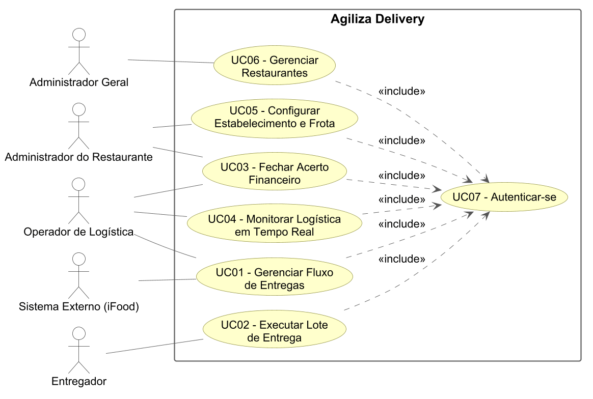
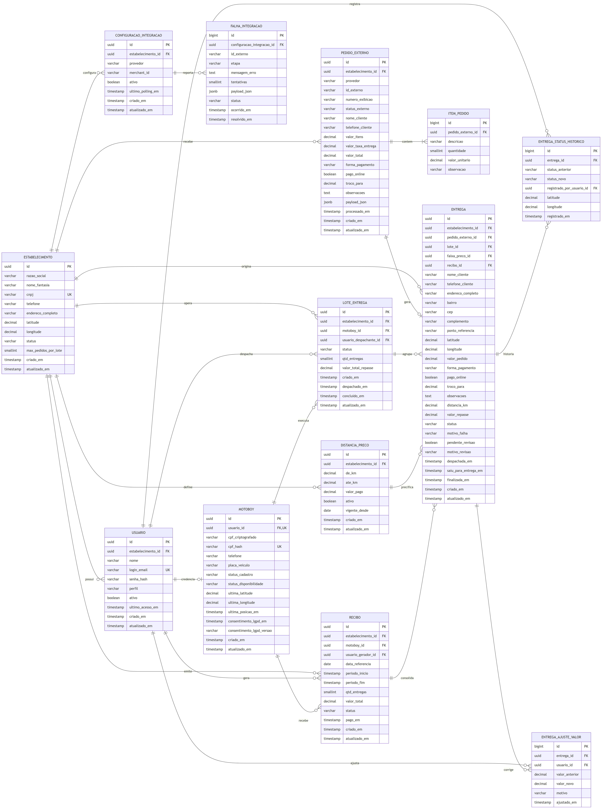
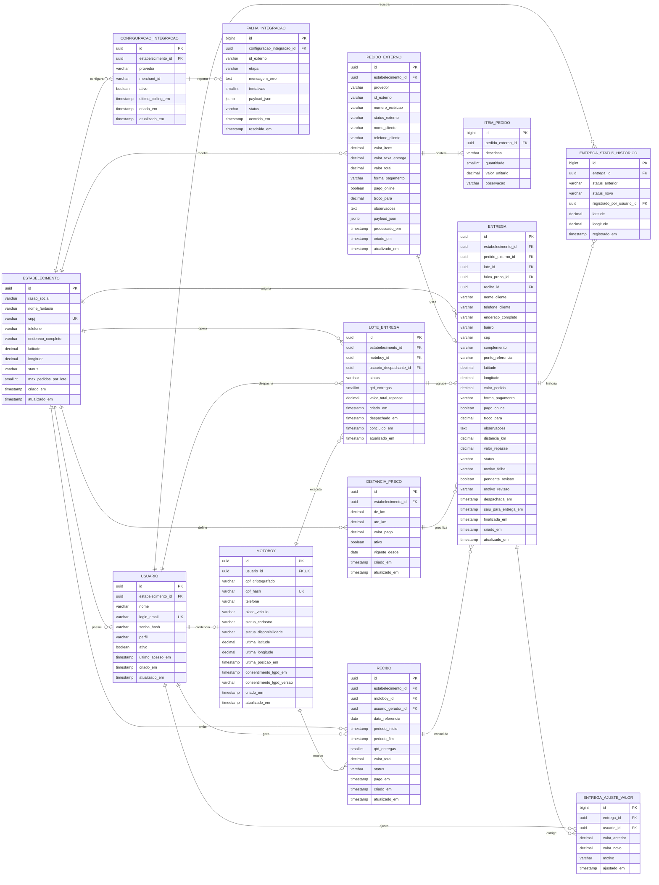

# DOCUMENTO DE VISÃO DO PRODUTO – DVP

**AGILIZA DELIVERY**

Eduardo dos Santos de Camargo
2026

## Histórico de alterações do documento

| *Versão* | *Alteração efetuada* | *Responsável* | *Data* |
| :---: | ----- | :---: | :---: |
| 1.0 | Criação do DVP | Eduardo S.C | 04/08/2026 |
| 1.5 | Finalização do DVP | Eduardo S.C | 12/08/2026 |
| 2.0 | Versão Final do DVP | Eduardo S.C | 02/09/2026 |
| 2.1 | Revisão técnica: stack padronizada em Spring Boot; inclusão de escopo, premissas, restrições, riscos e glossário; descrição dos casos de uso; matriz de rastreabilidade; máquina de estados; definição da regra de precificação; reformulação do modelo lógico do banco de dados | Eduardo S.C | 16/09/2026 |
| 2.2 | Revisão de consistência: prazo ajustado para 17/11/2026; telemetria restrita à última posição; regra de congelamento e ajuste manual do repasse; repasse de entregas canceladas; sincronização do diagrama ER com o dicionário de dados; inclusão de ITEM_PEDIDO, ENTREGA_AJUSTE_VALOR e FALHA_INTEGRACAO; dados do cliente na ENTREGA (entregas avulsas); marcação de revisão; consentimento LGPD; índice cego para unicidade do CPF | Eduardo S.C | 02/10/2026 |
| 2.3 | Distância de rota via Google Maps (substitui Haversine); credenciais do provedor no nível da aplicação; remoção do estado CRIADO do lote; fluxos de devolução de lote, pagamento e cancelamento de recibo; cancelamento durante EM_ROTA; UC07 – Autenticar-se e HU13; HU10 rastreada ao RF03; ajustes do cronograma (endpoint de teste e protótipo de GPS na Entrega 5) | Eduardo S.C | 02/10/2026 |
| 2.4 | Ajustes decorrentes da implementação da camada de persistência: MOTOBOY deixa de ter FK própria para ESTABELECIMENTO, alcançado pelo USUARIO; padronização das datas de controle (`criado_em` e `atualizado_em`) em todas as entidades com PK UUID; campos de domínio fechado passam de VARCHAR com CHECK para tipo ENUM; inclusão das convenções gerais no dicionário de dados | Eduardo S.C | 02/10/2026 |

---

## Sumário

1. [REQUISITOS](#1-requisitos)
   - 1.1. [Fundamentação dos Requisitos](#11-fundamentação-dos-requisitos)
     - 1.1.1. [Técnicas Utilizadas para Requisitos](#111-técnicas-utilizadas-para-requisitos)
   - 1.2. [Concepção dos Requisitos](#12-concepção-dos-requisitos)
     - 1.2.1. [Identificação do Domínio](#121-identificação-do-domínio)
     - 1.2.2. [Principais Stakeholders](#122-principais-stakeholders)
     - 1.2.3. [Objetivos do Produto e Métricas de Sucesso](#123-objetivos-do-produto-e-métricas-de-sucesso)
     - 1.2.4. [Escopo do Produto](#124-escopo-do-produto)
     - 1.2.5. [Premissas e Restrições](#125-premissas-e-restrições)
     - 1.2.6. [Riscos do Projeto](#126-riscos-do-projeto)
     - 1.2.7. [Glossário](#127-glossário)
   - 1.3. [Elicitação dos Requisitos](#13-elicitação-dos-requisitos)
     - 1.3.1. [Requisitos Funcionais (RF)](#131-requisitos-funcionais-rf)
     - 1.3.2. [Requisitos Não-Funcionais (RNF)](#132-requisitos-não-funcionais-rnf)
   - 1.4. [Especificação dos Requisitos](#14-especificação-dos-requisitos)
     - 1.4.1. [UML – Diagrama de Casos de Uso](#141-uml--diagrama-de-casos-de-uso)
     - 1.4.2. [Descrição dos Casos de Uso](#142-descrição-dos-casos-de-uso)
     - 1.4.3. [Histórias de Usuário Por Caso de Uso](#143-histórias-de-usuário-por-caso-de-uso)
     - 1.4.4. [Máquina de Estados dos Objetos de Negócio](#144-máquina-de-estados-dos-objetos-de-negócio)
     - 1.4.5. [Matriz de Rastreabilidade](#145-matriz-de-rastreabilidade)
   - 1.5. [Projeto Técnico](#15-projeto-técnico)
     - 1.5.1. [Arquitetura Utilizada](#151-arquitetura-utilizada)
     - 1.5.2. [Ferramentas e Tecnologias](#152-ferramentas-e-tecnologias)
     - 1.5.3. [Modelo Lógico do Banco de Dados](#153-modelo-lógico-do-banco-de-dados)
     - 1.5.4. [Dicionário de Dados](#154-dicionário-de-dados)
     - 1.5.5. [Regra de Precificação e Cálculo do Repasse](#155-regra-de-precificação-e-cálculo-do-repasse)
     - 1.5.6. [Integração com Provedores de Pedidos](#156-integração-com-provedores-de-pedidos)
2. [GESTÃO DE PROJETOS](#2-gestão-de-projetos)
   - 2.1. [MVP](#21-mvp)
   - 2.2. [Cronograma de Codificação do Projeto](#22-cronograma-de-codificação-do-projeto)

---

# 1. REQUISITOS

## 1.1. Fundamentação dos Requisitos

### 1.1.1. Técnicas Utilizadas para Requisitos

- Entrevistas e reuniões com stakeholders (gestores de restaurantes com frota própria).
- Análise de documentos — planilhas de acerto financeiro utilizadas atualmente pelos restaurantes.
- Observação direta da operação de despacho no balcão em horário de pico.
- Brainstorming para definição da arquitetura de integração com provedores de pedidos (iFood).
- Prototipação conceitual, materializada nos casos de uso e nas histórias de usuário deste documento.

## 1.2. Concepção dos Requisitos

### 1.2.1. Identificação do Domínio

O **Agiliza Delivery** é uma plataforma que atua como o sistema nervoso central da logística de entregas para restaurantes com frota própria. O problema atual é a gestão "cega" da frota, o acerto financeiro manual e empírico de quilometragem, e a perda de tempo na digitação e no agrupamento de pedidos.

A plataforma propõe um ecossistema descentralizado composto por: um aplicativo móvel (Flutter) para os entregadores, responsável pelo rastreamento e pela marcação de status; um Backoffice Web para que o operador realize o despacho visual via mapa; e um Backend focado em integrações automáticas de pedidos (por exemplo, a API do iFood) e no cálculo da precificação baseada na distância de cada entrega.

O sistema é **multilocatário (multi-tenant)**: uma mesma instalação atende diversos restaurantes parceiros, com isolamento lógico dos dados operacionais e financeiros de cada um.

### 1.2.2. Principais Stakeholders

| STAKEHOLDER | | |
| ----- | ----- | ----- |
| **Nome do Stakeholder** | **Responsabilidade** | **Contato** |
| Administrador Geral | Dono da plataforma. Cadastra, ativa e inativa restaurantes parceiros; patrocinador do produto. | [a preencher] |
| Administrador do Restaurante | Gestor/dono da loja. Define métricas financeiras, cadastra entregadores e configura a tabela de preços. | [a preencher] |
| Operador de Logística | Agrupa entregas visualmente, despacha lotes e fecha o acerto financeiro do turno. | [a preencher] |
| Entregador | Executa as entregas em campo via aplicativo e reporta o status de cada etapa. | [a preencher] |
| Sistema Externo (iFood) | Ator de sistema. Origem automática dos pedidos consumidos pela plataforma. | Portal do Desenvolvedor iFood |

> **Nota de padronização:** os nomes acima são os mesmos utilizados no diagrama de casos de uso (seção 1.4.1) e nas histórias de usuário (seção 1.4.3). O termo "motoboy", usado coloquialmente, corresponde ao ator **Entregador**.

### 1.2.3. Objetivos do Produto e Métricas de Sucesso

| Objetivo de negócio | Métrica | Situação atual | Meta com o produto |
| ----- | ----- | :---: | :---: |
| Eliminar a redigitação de pedidos | % de pedidos importados automaticamente do provedor | 0% | ≥ 95% |
| Acelerar o despacho | Tempo entre o pedido ficar pronto e ser despachado | ~8 min | < 2 min |
| Dar visibilidade da frota | % do turno em que a posição do entregador online é conhecida | 0% | ≥ 95% |
| Tornar o acerto financeiro auditável | Tempo de fechamento do acerto por entregador | ~30 min (planilha) | < 2 min |
| Eliminar divergências de pagamento | Nº de contestações de valor por turno | Recorrente | 0 |

### 1.2.4. Escopo do Produto

**Dentro do escopo (MVP)**

- Importação automática de pedidos a partir de provedor externo (iFood) e cadastro manual de entrega avulsa.
- Painel Web de despacho com mapa, agrupamento de pedidos em lote e envio ao entregador.
- Aplicativo Android para o entregador: autenticação, recebimento de lote, atalhos de navegação e contato, atualização de status.
- Telemetria de GPS em segundo plano e monitoramento da frota em tempo real no painel Web.
- Cálculo automático do repasse por faixa de distância e geração de recibo de acerto.
- Cadastro e isolamento de dados de múltiplos restaurantes parceiros.

**Fora do escopo (versões futuras)**

- Otimização algorítmica de sequência da rota (problema do caixeiro-viajante); o agrupamento do MVP é manual, feito pelo operador.
- Pagamento ao entregador dentro da plataforma; o sistema calcula e comprova, mas o PIX é executado fora dele.
- Aplicativo para iOS.
- Chat interno entre operador e entregador (o MVP usa deep link para o WhatsApp).
- Avaliação e ranqueamento de entregadores.
- Relatórios analíticos avançados e BI; o MVP entrega apenas o extrato e o recibo de acerto.
- Integração com outros provedores além do iFood (a arquitetura prevê a extensão, mas somente o iFood é implementado).

### 1.2.5. Premissas e Restrições

**Premissas**

- O restaurante possui frota própria, com entregadores vinculados a ele.
- O entregador dispõe de smartphone Android com GPS e plano de dados ativo.
- O restaurante possui conexão de internet estável no balcão de operação.
- Os endereços recebidos do provedor externo trazem coordenadas ou são passíveis de geocodificação.
- O restaurante possui cadastro ativo e homologado junto ao provedor externo.

**Restrições**

- O aplicativo do entregador será entregue apenas para Android (Flutter).
- A integração limita-se às APIs oficiais e públicas do provedor; não haverá raspagem de dados (*scraping*).
- O projeto é desenvolvido por um único desenvolvedor, com prazo acadêmico encerrando em 17/11/2026.
- A distância de cada entrega é a **distância de rota** (percurso viário) entre a loja e o endereço do cliente, obtida por API de rotas (Google Maps Platform – Routes API), e não a distância em linha reta.

### 1.2.6. Riscos do Projeto

| ID | Risco | Prob. | Impacto | Mitigação |
| :---: | ----- | :---: | :---: | ----- |
| R01 | O acesso à API do iFood depende de homologação/parceria comercial, que pode não ser concedida no prazo do projeto | Alta | Alto | Modelar a integração como *Provedor de Pedidos* com padrão Adapter; desenvolver um simulador de provedor que responda no mesmo contrato, permitindo concluir a Entrega 3 e todas as seguintes sem depender da homologação |
| R02 | Restrições de execução em segundo plano do Android (Doze/App Standby) interrompem a telemetria | Média | Alto | Implementar *foreground service* com notificação persistente e validar um protótipo em aparelho físico já na Entrega 5, deixando a Entrega 7 apenas para a integração completa |
| R03 | Conectividade instável do entregador em rua impede o reporte de status | Alta | Médio | Fila local de eventos no aplicativo com sincronização posterior (RNF09) |
| R04 | Geocodificação imprecisa de endereços gera cálculo de repasse incorreto | Alta | Médio | Permitir o ajuste manual do pino pelo operador antes do despacho e registrar a coordenada efetivamente utilizada na entrega |
| R05 | Escopo amplo para a cadência semanal de entregas | Média | Alto | Escopo do MVP priorizado por requisito; funcionalidades fora do MVP explicitamente listadas na seção 1.2.4 |
| R06 | Custo e indisponibilidade das APIs de mapas, geocodificação e rotas | Média | Médio | Distância calculada uma única vez por entrega (e novamente só se o operador ajustar o pino); cache da coordenada e da distância por endereço normalizado; em falha da API, a entrega é marcada para revisão sem bloquear o despacho (seção 1.5.5) |
| R07 | Consumo excessivo de bateria do aparelho do entregador | Média | Médio | Intervalo de coleta de 20 s (RNF01) e envio em lote das posições acumuladas |

### 1.2.7. Glossário

| Termo | Definição |
| ----- | ----- |
| **Tele** | Jargão do setor para uma entrega individual. Neste documento o termo oficial é **entrega**. |
| **Entrega** | Deslocamento até um único cliente, com um pedido associado. É a unidade de cobrança do repasse. |
| **Lote de Entrega** | Conjunto de até *N* entregas agrupadas e despachadas para um mesmo entregador em uma única saída. Termo oficial; "rota" e "corrida" são sinônimos coloquiais e não são usados neste documento. |
| **Despacho** | Ato de atribuir um lote de entrega a um entregador disponível. |
| **Acerto** | Fechamento financeiro do período de trabalho do entregador, consolidado em um recibo. |
| **Faixa de preço** | Intervalo de distância (de–até, em km) ao qual corresponde um valor fixo de repasse. |
| **Backoffice** | Aplicação Web utilizada pelo operador e pelos administradores. |
| **Polling** | Consulta periódica e automática à API do provedor externo em busca de novos pedidos. |
| **Telemetria** | Coleta e transmissão contínua da posição GPS do entregador. |
| **Deep link** | Endereço que abre um aplicativo de terceiros já com o contexto carregado (Waze, Google Maps, WhatsApp). |
| **Merchant** | Identificador da loja junto ao provedor externo. |
| **Multilocação (multi-tenant)** | Capacidade de a mesma instalação atender vários restaurantes com isolamento de dados. |

## 1.3. Elicitação dos Requisitos

### 1.3.1. Requisitos Funcionais (RF)

#### 1.3.1.1. RF01 – Gestão Operacional de Despacho (Web)

| Importância: | [ X ] essencial       [   ] importante       [    ] desejável |
| :---- | :---- |
| **Priorização:** | [ X ] 1   [   ] 2   [   ] 3   [   ] 4   [   ] 5 |
| **Dependência com outro(s) requisito(s):** | *Nenhuma* |
| **Problema /Necessidades Identificadas:** *Centraliza o recebimento automático de pedidos (integração com provedor externo), a visualização da localização dos clientes em mapa e o agrupamento de múltiplos pedidos em um único lote, permitindo o despacho dinâmico para os entregadores e o registro dos tempos operacionais de cada etapa.* | |

#### 1.3.1.2. RF02 – Operação e Interação do Entregador (Mobile)

| Importância: | [ X ] essencial       [   ] importante       [    ] desejável |
| :---- | :---- |
| **Priorização:** | [ X ] 1   [   ] 2   [   ] 3   [   ] 4   [   ] 5 |
| **Dependência com outro(s) requisito(s):** | *RF01* |
| **Problema /Necessidades Identificadas:** *O aplicativo móvel torna-se o terminal de trabalho do entregador, permitindo gerenciar disponibilidade, receber notificações de lotes, visualizar as entregas e seus detalhes, acionar atalhos nativos (Waze/Google Maps/WhatsApp) e atualizar o status de cada entrega em tempo real.* | |

#### 1.3.1.3. RF03 – Gestão Financeira e Precificação (Web)

| Importância: | [ X ] essencial       [   ] importante       [    ] desejável |
| :---- | :---- |
| **Priorização:** | [   ] 1   [ X ] 2   [   ] 3   [   ] 4   [   ] 5 |
| **Dependência com outro(s) requisito(s):** | *RF01, RF06* |
| **Problema /Necessidades Identificadas:** *O sistema mantém uma tabela de faixas de preço por distância e calcula automaticamente o valor devido ao entregador a cada entrega concluída, culminando na geração de recibos para o acerto financeiro do turno e eliminando os erros do cálculo manual em planilha.* | |

#### 1.3.1.4. RF04 – Rastreamento e Telemetria de Frota (Mobile/Web)

| Importância: | [ X ] essencial       [   ] importante       [    ] desejável |
| :---- | :---- |
| **Priorização:** | [   ] 1   [ X ] 2   [   ] 3   [   ] 4   [   ] 5 |
| **Dependência com outro(s) requisito(s):** | *RF02* |
| **Problema /Necessidades Identificadas:** *Captura contínua da localização GPS do entregador em segundo plano, mantendo apenas a última posição conhecida de cada entregador (RNF07) e integrando-se ao painel Web para o monitoramento da frota em tempo real no mapa. Para fins de auditoria, a coordenada do entregador é registrada somente em cada mudança de status da entrega (ENTREGA_STATUS_HISTORICO); não há trilha contínua de posições.* | |

#### 1.3.1.5. RF05 – Administração do Sistema e Segurança (Web)

| Importância: | [ X ] essencial       [   ] importante       [    ] desejável |
| :---- | :---- |
| **Priorização:** | [ X ] 1   [   ] 2   [   ] 3   [   ] 4   [   ] 5 |
| **Dependência com outro(s) requisito(s):** | *RF06* |
| **Problema /Necessidades Identificadas:** *Controla a autenticação e a autorização de todos os usuários por perfil de acesso, permitindo o CRUD de entregadores pelo Administrador do Restaurante e a parametrização operacional da loja (limite de pedidos por lote e vínculo com o provedor de pedidos). A manutenção das faixas de preço pertence ao RF03. A extração de relatórios analíticos está fora do escopo do MVP, conforme a seção 1.2.4.* | |

#### 1.3.1.6. RF06 – Gestão de Restaurantes Parceiros (Web)

| Importância: | [ X ] essencial       [   ] importante       [    ] desejável |
| :---- | :---- |
| **Priorização:** | [ X ] 1   [   ] 2   [   ] 3   [   ] 4   [   ] 5 |
| **Dependência com outro(s) requisito(s):** | *Nenhuma* |
| **Problema /Necessidades Identificadas:** *Permite que o sistema funcione para múltiplos clientes, gerindo o cadastro, a ativação, o bloqueio e o isolamento de dados de cada restaurante parceiro na plataforma.* | |

### 1.3.2. Requisitos Não-Funcionais (RNF)

| Identificação | Categoria | Descrição |
| ----- | ----- | ----- |
| RNF01 | Desempenho | O aplicativo móvel deve capturar a posição GPS a cada 20 segundos e transmiti-la em lotes de até 5 posições, de modo a limitar o consumo de bateria e de dados móveis. |
| RNF02 | Segurança | As senhas devem ser armazenadas com hash BCrypt (fator de custo ≥ 10) e o CPF dos entregadores deve ser persistido criptografado. Em nenhuma hipótese esses dados podem ser retornados em texto claro pelas APIs. |
| RNF03 | Desempenho | As APIs internas devem responder em até 3 segundos no percentil 95, considerando a carga prevista no RNF12. |
| RNF04 | Confiabilidade | O *worker* de integração deve tolerar indisponibilidade do provedor externo, aplicando repetição com recuo exponencial (*exponential backoff*) por até 5 tentativas; após isso, o pedido é encaminhado para uma fila de erro e sinalizado no painel, sem interromper o ciclo de *polling*. |
| RNF05 | Manutenibilidade | O backend deve seguir rigorosamente a arquitetura em camadas do Spring Boot — Controller (REST), Service (regra de negócio), Repository (Spring Data JPA) e Entity (mapeamento objeto-relacional) — sem que uma camada superior seja acessada por uma inferior. |
| RNF06 | Desempenho | A tela de despacho deve refletir a posição da frota e a mudança de status das entregas via WebSocket, com propagação de no máximo 5 segundos a partir do recebimento do evento pelo servidor. |
| RNF07 | Conformidade | O tratamento de CPF e de dados de geolocalização deve observar a LGPD (Lei 13.709/2018): coleta limitada à finalidade de execução do contrato de trabalho, consentimento registrado no primeiro acesso ao aplicativo, e telemetria coletada (apenas posição atual) somente enquanto o entregador estiver com status ONLINE ou EM_ROTA. |
| RNF08 | Disponibilidade | O sistema deve apresentar disponibilidade mínima de 99% na janela crítica de operação (18h às 23h59), período em que se concentra o volume de pedidos. |
| RNF09 | Confiabilidade | O aplicativo deve operar sem conexão: as mudanças de status e as posições GPS são gravadas em fila local e sincronizadas automaticamente ao restabelecimento da rede, preservando o horário original do evento. |
| RNF10 | Portabilidade | O aplicativo deve ser compatível com Android 8.0 (API 26) ou superior. |
| RNF11 | Usabilidade | As ações de mudança de status no aplicativo devem ser operáveis com uma das mãos, com alvos de toque de no mínimo 48 dp e confirmação em, no máximo, dois toques. |
| RNF12 | Escalabilidade | A solução deve suportar 50 restaurantes ativos, 200 entregadores simultâneos online e 2.000 entregas por dia, mantendo o desempenho definido no RNF03. |
| RNF13 | Auditabilidade | Toda resposta recebida do provedor externo deve ser persistida em seu formato original (JSON), permitindo o reprocessamento e a comprovação da origem do pedido. |

## 1.4. Especificação dos Requisitos

### 1.4.1. UML – Diagrama de Casos de Uso

O diagrama apresentado abaixo contempla todos os casos de uso definidos para a solução.

*Código-fonte do diagrama: PlantUML, arquivo `docs/img/uc-casos-de-uso.puml`.*

| Caso de uso | Ator principal | Atores secundários |
| ----- | ----- | ----- |
| UC01 – Gerenciar Fluxo de Entregas | Operador de Logística | Sistema Externo (iFood) |
| UC02 – Executar Lote de Entrega | Entregador | — |
| UC03 – Fechar Acerto Financeiro | Operador de Logística | Administrador do Restaurante |
| UC04 – Monitorar Logística em Tempo Real | Operador de Logística | — |
| UC05 – Configurar Estabelecimento e Frota | Administrador do Restaurante | — |
| UC06 – Gerenciar Restaurantes | Administrador Geral | — |
| UC07 – Autenticar-se | Administrador Geral, Administrador do Restaurante, Operador de Logística, Entregador | — |

> O UC07 é incluído (*include*) por todos os demais casos de uso, que o têm como pré-condição.

### 1.4.2. Descrição dos Casos de Uso

#### 1.4.2.1. UC01 – Gerenciar Fluxo de Entregas

| | |
| ----- | ----- |
| **Ator principal** | Operador de Logística |
| **Atores secundários** | Sistema Externo (iFood) |
| **Pré-condições** | O operador está autenticado; o estabelecimento está com status ATIVO; a integração com o provedor está configurada. |
| **Fluxo principal** | 1. O *worker* consulta o provedor externo a cada 30 s. 2. O sistema identifica pedidos ainda não importados e os persiste. 3. O sistema geocodifica o endereço, calcula a distância até a loja e determina a faixa de preço. 4. A entrega passa a AGUARDANDO_DESPACHO e seu pino aparece no mapa. 5. O operador seleciona de 1 a *N* pedidos próximos. 6. O operador seleciona um entregador ONLINE e confirma o despacho. 7. O sistema cria o lote, muda as entregas para DESPACHADA e notifica o aplicativo via WebSocket. |
| **Fluxos alternativos** | **A1 – Endereço não geocodificado:** a entrega é marcada para revisão (`pendente_revisao`) e o operador ajusta o pino manualmente antes de despachar. **A2 – Pedido avulso:** o operador cadastra manualmente a entrega, informando endereço e dados do cliente e do pagamento diretamente na ENTREGA (sem PEDIDO_EXTERNO); o fluxo segue do passo 3. **A3 – Provedor indisponível:** aplica-se o RNF04; o painel exibe o alerta de integração degradada. **A4 – Devolver lote:** enquanto o lote estiver DESPACHADO (o entregador ainda não saiu da loja), o operador pode desfazer o despacho; o lote passa a CANCELADO, suas entregas voltam a AGUARDANDO_DESPACHO (com `lote_id` nulo e a transição registrada no histórico), o entregador volta a ONLINE e o aplicativo é notificado. |
| **Fluxos de exceção** | **E1 – Nenhum entregador ONLINE:** o sistema bloqueia o despacho e informa o operador. **E2 – Limite do lote excedido:** o sistema recusa a seleção acima do limite parametrizado na loja. |
| **Pós-condições** | Lote criado com status DESPACHADO e visível no aplicativo do entregador. |

#### 1.4.2.2. UC02 – Executar Lote de Entrega

| | |
| ----- | ----- |
| **Ator principal** | Entregador |
| **Pré-condições** | O entregador está autenticado, com cadastro ATIVO e status ONLINE; existe lote despachado para ele. |
| **Fluxo principal** | 1. O entregador recebe a notificação do lote. 2. Visualiza a lista de entregas com endereço, itens, valor e forma de pagamento. 3. Aciona o deep link de navegação ou de contato conforme a necessidade. 4. Ao sair da loja, registra o início do percurso. 5. A cada cliente, registra ENTREGUE ou FALHA. 6. Ao concluir a última entrega, o lote é encerrado e o repasse é consolidado. |
| **Fluxos alternativos** | **A1 – Falha na entrega:** o entregador seleciona o motivo; a entrega vai para FALHA e, conforme a regra da seção 1.5.5, o repasse é devido integralmente. **A2 – Sem conexão:** o evento é enfileirado localmente e sincronizado depois (RNF09). **A3 – Pedido cancelado durante o percurso:** quando o provedor (detectado pelo `status_externo`) ou o operador cancela uma entrega EM_ROTA, o aplicativo alerta o entregador, que retorna o pedido à loja; a entrega vai para CANCELADA e, conforme a seção 1.5.5, o repasse é devido integralmente. |
| **Fluxos de exceção** | **E1 – Aplicativo sem permissão de localização:** o sistema impede a mudança para ONLINE e orienta a concessão da permissão. |
| **Pós-condições** | Todas as entregas do lote em estado final; lote CONCLUIDO; valores de repasse gravados. |

#### 1.4.2.3. UC03 – Fechar Acerto Financeiro

| | |
| ----- | ----- |
| **Ator principal** | Operador de Logística |
| **Atores secundários** | Administrador do Restaurante |
| **Pré-condições** | Existem entregas em estado final e ainda não incluídas em recibo. |
| **Fluxo principal** | 1. O operador seleciona o entregador e o período. 2. O sistema lista as entregas do período com a faixa aplicada e o valor de cada uma. 3. O sistema apresenta o total devido. 4. O operador confirma o acerto. 5. O sistema gera o recibo com status GERADO, vincula as entregas a ele e as torna imutáveis. 6. Após realizar o PIX fora da plataforma, o operador marca o recibo como PAGO e o sistema registra `pago_em`. |
| **Fluxos alternativos** | **A1 – Divergência identificada:** antes de confirmar, o operador ajusta o valor do repasse da entrega, informando obrigatoriamente o motivo; o ajuste é registrado em ENTREGA_AJUSTE_VALOR (valor anterior, valor novo, autor e horário) e o total é recalculado. Ajustes só são permitidos enquanto a entrega não estiver vinculada a recibo (seção 1.5.5). **A2 – Cancelar recibo:** enquanto o recibo estiver GERADO, o operador pode cancelá-lo informando o motivo; o recibo passa a CANCELADO e suas entregas são desvinculadas (`recibo_id` nulo), voltando a estar disponíveis para ajuste e novo acerto. Recibos PAGOS não podem ser cancelados. |
| **Fluxos de exceção** | **E1 – Entrega já vinculada a recibo:** o sistema a exclui da seleção e informa o número do recibo anterior. |
| **Pós-condições** | Recibo com status GERADO (ou PAGO, após o passo 6); entregas bloqueadas para alteração de valor. |

#### 1.4.2.4. UC04 – Monitorar Logística em Tempo Real

| | |
| ----- | ----- |
| **Ator principal** | Operador de Logística |
| **Pré-condições** | Há pelo menos um entregador com status ONLINE ou EM_ROTA. |
| **Fluxo principal** | 1. O operador abre o mapa de monitoramento. 2. O sistema carrega a última posição conhecida de cada entregador. 3. O sistema abre o canal WebSocket. 4. As posições e os status são atualizados na tela conforme chegam. |
| **Fluxos alternativos** | **A1 – Entregador sem transmitir há mais de 3 minutos:** o ícone é exibido em estado de alerta com o horário da última posição. |
| **Pós-condições** | Nenhuma alteração de estado; caso de uso de consulta. |

#### 1.4.2.5. UC05 – Configurar Estabelecimento e Frota

| | |
| ----- | ----- |
| **Ator principal** | Administrador do Restaurante |
| **Pré-condições** | Administrador autenticado em estabelecimento ATIVO. |
| **Fluxo principal** | 1. O administrador acessa a configuração da loja. 2. Cadastra, edita, bloqueia ou desbloqueia entregadores. 3. Mantém as faixas de preço por distância. 4. Define o limite de pedidos por lote. 5. Vincula a loja ao provedor informando o identificador da loja no provedor (`merchant_id`), após autorizar o Agiliza Delivery no portal do provedor. |
| **Fluxos de exceção** | **E1 – Faixas sobrepostas:** o sistema recusa a gravação e indica o conflito. **E2 – CPF já cadastrado:** o sistema recusa a duplicidade. |
| **Pós-condições** | Parâmetros vigentes para os próximos cálculos; faixas anteriores preservadas para fins de auditoria. |

#### 1.4.2.6. UC06 – Gerenciar Restaurantes

| | |
| ----- | ----- |
| **Ator principal** | Administrador Geral |
| **Pré-condições** | Autenticado com perfil ADMIN_GERAL. |
| **Fluxo principal** | 1. Cadastra o restaurante com CNPJ único. 2. O sistema cria o usuário master da loja e envia as credenciais. 3. O administrador pode inativar ou reativar o estabelecimento. |
| **Fluxos de exceção** | **E1 – CNPJ já cadastrado:** o sistema recusa a operação. |
| **Pós-condições** | Estabelecimento apto a operar, ou bloqueado para login de todos os seus usuários. |

#### 1.4.2.7. UC07 – Autenticar-se

| | |
| ----- | ----- |
| **Atores principais** | Administrador Geral, Administrador do Restaurante, Operador de Logística, Entregador |
| **Pré-condições** | O usuário possui cadastro em USUARIO. |
| **Fluxo principal** | 1. O usuário informa e-mail e senha no Backoffice Web ou no aplicativo. 2. O sistema valida a senha contra o hash BCrypt (RNF02). 3. O sistema verifica se o usuário está ativo e, exceto para ADMIN_GERAL, se o estabelecimento vinculado está ATIVO. 4. Para o perfil ENTREGADOR, verifica também se o cadastro do entregador está ATIVO. 5. O sistema emite um token JWT contendo o identificador do usuário, o perfil e o estabelecimento, e registra `ultimo_acesso_em`. 6. O cliente direciona o usuário às funcionalidades do seu perfil. |
| **Fluxos alternativos** | **A1 – Primeiro acesso do entregador:** antes de liberar o aplicativo, o sistema exibe o termo de consentimento LGPD e registra o aceite (RNF07). **A2 – Token expirado:** a requisição é recusada e o cliente redireciona para nova autenticação. |
| **Fluxos de exceção** | **E1 – Credenciais inválidas:** o sistema recusa com mensagem genérica, sem indicar se o erro está no e-mail ou na senha. **E2 – Estabelecimento INATIVO:** o sistema recusa e informa que o acesso da loja está suspenso (HU12). **E3 – Usuário inativo ou entregador BLOQUEADO:** o sistema recusa o acesso. **E4 – Perfil incompatível com o cliente:** um usuário ENTREGADOR não acessa o Backoffice, e os demais perfis não acessam o aplicativo. |
| **Pós-condições** | Usuário autenticado com token válido; todas as consultas operacionais passam a ser filtradas pelo seu estabelecimento. |

### 1.4.3. Histórias de Usuário Por Caso de Uso

#### 1.4.3.1. UC01 – Gerenciar Fluxo de Entregas

| Objetivo: | Permitir a recepção de pedidos, o agrupamento em mapa e o despacho ágil para a frota disponível. |
| ----- | :---- |
| **HISTÓRIAS DE USUÁRIOS** | |

**História: HU01 – Planejar lotes via mapa**
**Descrição:** COMO Operador de Logística, QUERO visualizar os novos pedidos distribuídos geograficamente em um mapa PARA planejar rapidamente lotes inteligentes.
**Regras de Negócio:** Apenas entregas com status AGUARDANDO_DESPACHO aparecem no mapa de pendentes. Entregas sem coordenada válida são exibidas em uma lista de revisão, não no mapa.
**Critérios de Aceite:** Dado que o operador selecionou os pedidos A e B no mapa, Quando ele clicar em "Despachar" e selecionar o entregador João, Então os pinos devem sair do mapa de pendentes e o lote deve aparecer no aplicativo do João.

**História: HU02 – Despachar múltiplos pedidos**
**Descrição:** COMO Operador de Logística, QUERO selecionar e agrupar múltiplos pedidos próximos em um mesmo despacho PARA otimizar o tempo e o custo do entregador.
**Regras de Negócio:** O entregador de destino deve estar com status ONLINE e cadastro ATIVO. Um lote pode conter até o limite configurado no estabelecimento (padrão: 5 pedidos).
**Critérios de Aceite:** Dado que o operador selecionou até 5 pedidos próximos no mapa; Quando ele clicar em "Despachar Lote" e selecionar o entregador; Então esses pedidos devem formar um único lote no aplicativo do entregador.

**História: HU03 – Importar pedidos do provedor externo**
**Descrição:** COMO Sistema, DEVO importar os pedidos do provedor externo automaticamente PARA eliminar o gargalo de redigitação por parte do operador.
**Regras de Negócio:** A captura (*polling*) ocorre a cada 30 segundos por meio da API oficial de integração. O par (provedor, identificador externo) é único: um mesmo pedido nunca é importado duas vezes, ainda que retorne em várias consultas. O endereço, os itens, o valor, a forma de pagamento e a indicação de pagamento on-line devem ser importados.
**Critérios de Aceite:** Dado que o restaurante está on-line no provedor, Quando um cliente fizer e pagar um novo pedido, Então esse pedido aparecerá no painel "Aguardando Despacho" e no mapa do Agiliza Delivery, sem intervenção manual e sem duplicidade.

#### 1.4.3.2. UC02 – Executar Lote de Entrega

| Objetivo: | Fornecer suporte tecnológico ao entregador na rua para encontrar o cliente e reportar o andamento. |
| ----- | :---- |
| **HISTÓRIAS DE USUÁRIOS** | |

**História: HU04 – Atalhos nativos de GPS e contato**
**Descrição:** COMO Entregador, QUERO abrir aplicativos de navegação (Waze/Google Maps) e o WhatsApp do cliente diretamente pelo aplicativo Agiliza PARA economizar tempo digitando na rua.
**Regras de Negócio:** O aplicativo utiliza deep links para transmitir a localização exata ao GPS ou o número do cliente com a mensagem pronta ao WhatsApp.
**Critérios de Aceite:** Dado que o entregador abriu a tela da entrega X, Quando ele tocar em "Navegar" ou "WhatsApp", Então o aplicativo correspondente abrirá automaticamente, já traçando a rota até o cliente ou abrindo a conversa com ele.

**História: HU05 – Reportar andamento (status)**
**Descrição:** COMO Entregador, QUERO alterar o status de cada etapa da entrega com poucos toques PARA que a loja saiba do andamento em tempo real.
**Regras de Negócio:** Os status seguem a máquina de estados da seção 1.4.4. Uma entrega marcada como FALHA exige a seleção de um motivo e gera repasse integral da faixa, conforme a seção 1.5.5. Sem conexão, o evento é enfileirado e sincronizado depois, preservando o horário original (RNF09).
**Critérios de Aceite:** Dado que o entregador chegou ao local, Quando ele tocar em "Entregue" ou "Falha", Então a entrega muda de status no painel Web em até 5 segundos, notificando o operador.

#### 1.4.3.3. UC03 – Fechar Acerto Financeiro

| Objetivo: | Automatizar e auditar o pagamento devido aos entregadores no encerramento de um período. |
| ----- | :---- |
| **HISTÓRIAS DE USUÁRIOS** | |

**História: HU06 – Calcular o repasse automaticamente**
**Descrição:** COMO Operador, QUERO que o sistema calcule automaticamente o valor devido ao entregador com base nas entregas realizadas e na tabela de faixas vigente PARA eliminar negociações e cálculos subjetivos.
**Regras de Negócio:** O valor é apurado **por entrega**, e não por lote: cada entrega recebe o valor da faixa correspondente à distância entre a loja e o cliente. O total do lote é a soma das suas entregas. A faixa aplicada e o valor são congelados no momento em que a entrega atinge estado final, de modo que uma alteração posterior na tabela de preços não altere entregas passadas. A regra completa está na seção 1.5.5.
**Critérios de Aceite:** Dado que um entregador finalizou um lote com três entregas de 2,1 km, 4,7 km e 1,4 km, Quando o operador abrir o extrato dele, Então o sistema exibirá R$ 9,00 + R$ 12,00 + R$ 9,00, totalizando R$ 30,00, com a faixa aplicada visível em cada linha.

**História: HU07 – Gerar recibo de acerto**
**Descrição:** COMO Operador, QUERO gerar um recibo unificado de todas as entregas feitas pelo entregador no período PARA realizar o PIX do acerto financeiro com rapidez e exatidão.
**Regras de Negócio:** Após a geração do recibo, as entregas nele contidas não podem sofrer alteração de valor nem ser incluídas em outro recibo. O recibo registra o período, a quantidade de entregas, o valor total e o usuário que o gerou.
**Critérios de Aceite:** Dado que o turno encerrou, Quando o operador confirmar o acerto, Então um comprovante digital detalhado é criado e as entregas passam a constar como vinculadas ao recibo; E uma nova tentativa de incluí-las em outro recibo é recusada pelo sistema.

#### 1.4.3.4. UC04 – Monitorar Logística em Tempo Real

| Objetivo: | Manter a visibilidade total da frota para a tomada rápida de decisões logísticas. |
| ----- | :---- |
| **HISTÓRIAS DE USUÁRIOS** | |

**História: HU08 – Monitorar a frota no mapa**
**Descrição:** COMO Operador, QUERO enxergar a posição em tempo real e o status atual de cada entregador da frota no mapa PARA saber imediatamente quem está mais perto de uma nova retirada.
**Regras de Negócio:** A posição é atualizada em segundo plano a cada 20 segundos enquanto o entregador estiver ONLINE ou EM_ROTA (RNF01), e a coleta cessa quando ele fica OFFLINE (RNF07). Apenas a última posição é mantida para visualização em tempo real.
**Critérios de Aceite:** Dado que um entregador está executando um lote, Quando o operador observar o mapa de monitoramento, Então um ícone identificado com o nome dele se moverá pelo mapa, com atraso máximo de 5 segundos em relação ao recebimento da posição pelo servidor.

#### 1.4.3.5. UC05 – Configurar Estabelecimento e Frota

| Objetivo: | Garantir a manutenção estrutural da loja e dos parâmetros financeiros específicos do restaurante. |
| ----- | :---- |
| **HISTÓRIAS DE USUÁRIOS** | |

**História: HU09 – Gerir entregadores**
**Descrição:** COMO Administrador do Restaurante, QUERO cadastrar entregadores e aprovar ou bloquear seus perfis PARA garantir que apenas pessoas da minha frota atuem nas minhas entregas.
**Regras de Negócio:** O cadastro do entregador gera automaticamente um usuário com perfil ENTREGADOR, vinculado ao estabelecimento. Entregadores com cadastro BLOQUEADO não podem ficar ONLINE nem receber lotes. O entregador só enxerga as entregas do estabelecimento ao qual está vinculado. O CPF é único no sistema e armazenado criptografado (RNF02).
**Critérios de Aceite:** Dado que um novo entregador foi contratado pelo restaurante, Quando o administrador criar o perfil na plataforma Web, Então o entregador conseguirá autenticar-se no aplicativo e ficar on-line para aquela loja.

**História: HU10 – Configurar regras de precificação**
**Descrição:** COMO Administrador do Restaurante, QUERO cadastrar faixas de preço com base na distância da entrega PARA que o repasse obedeça a regras justas e preestabelecidas.
**Regras de Negócio:** Cada faixa possui distância inicial e final, e as faixas de um mesmo estabelecimento não podem se sobrepor nem deixar lacunas (ex.: 0–3 km = R$ 9,00; 3–5 km = R$ 12,00). A tabela é própria de cada estabelecimento. Alterar uma faixa não recalcula entregas já finalizadas.
**Critérios de Aceite:** Dado que o administrador acessou o menu "Tabela de Preços"; Quando ele editar o valor da faixa "0 a 3 km" para R$ 6,00; Então as próximas entregas calcularão o repasse com o novo valor, e as entregas já concluídas permanecerão com o valor anterior.

#### 1.4.3.6. UC06 – Gerenciar Restaurantes

| Objetivo: | Permitir a entrada e o controle de diferentes restaurantes usando o mesmo sistema. |
| ----- | :---- |
| **HISTÓRIAS DE USUÁRIOS** | |

**História: HU11 – Cadastrar novo estabelecimento parceiro**
**Descrição:** COMO Administrador Geral, QUERO cadastrar os dados básicos de um novo restaurante PARA gerar seu primeiro acesso e liberar o uso do sistema.
**Regras de Negócio:** O CNPJ deve ser único no sistema. Ao criar o restaurante, seus dados operacionais ficam isolados dos das demais lojas por meio do vínculo obrigatório de estabelecimento em todas as entidades operacionais.
**Critérios de Aceite:** Dado que um novo restaurante deseja usar o serviço, Quando o Administrador Geral criar o cadastro da empresa, Então o dono do restaurante receberá suas credenciais de acesso master.

**História: HU12 – Inativar restaurante**
**Descrição:** COMO Administrador Geral, QUERO inativar temporariamente o acesso de um restaurante PARA impedir o uso do sistema (por exemplo, em fim de contrato ou falta de pagamento).
**Regras de Negócio:** Com o estabelecimento inativo, nenhum usuário vinculado a ele consegue autenticar-se, e os entregadores não conseguem ficar on-line para essa loja. O *worker* de integração deixa de consultar o provedor para esse estabelecimento.
**Critérios de Aceite:** Dado que o restaurante "Pizzaria XYZ" não utilizará mais o serviço, Quando o Administrador Geral alterar o status para INATIVO, Então os usuários do restaurante receberão mensagem de erro ao tentar autenticar-se.

#### 1.4.3.7. UC07 – Autenticar-se

| Objetivo: | Garantir que cada usuário acesse apenas as funcionalidades e os dados do seu perfil e do seu estabelecimento. |
| ----- | :---- |
| **HISTÓRIAS DE USUÁRIOS** | |

**História: HU13 – Acessar o sistema conforme o perfil**
**Descrição:** COMO usuário da plataforma (administrador, operador ou entregador), QUERO autenticar-me com e-mail e senha PARA acessar somente as funcionalidades do meu perfil e os dados do meu estabelecimento.
**Regras de Negócio:** A senha é validada contra o hash BCrypt (RNF02). O token JWT carrega o perfil e o estabelecimento, e todas as consultas operacionais são filtradas por esse estabelecimento. O acesso é negado a usuários inativos, a entregadores BLOQUEADOS e a usuários de estabelecimentos INATIVOS (HU12). A mensagem de erro de credenciais é genérica.
**Critérios de Aceite:** Dado que um operador da "Pizzaria XYZ" está autenticado, Quando ele consultar as entregas pendentes, Então o sistema exibirá apenas as entregas da "Pizzaria XYZ"; E uma tentativa de acessar por URL uma entrega de outro estabelecimento será recusada.

### 1.4.4. Máquina de Estados dos Objetos de Negócio

Os status citados nas histórias de usuário são definidos formalmente abaixo. Nenhum outro valor é admitido.

**ENTREGA**

| Status | Significado | Transições permitidas |
| ----- | ----- | ----- |
| AGUARDANDO_DESPACHO | Importada ou cadastrada; visível no mapa de pendentes | → DESPACHADA, CANCELADA |
| DESPACHADA | Incluída em um lote atribuído a um entregador | → EM_ROTA, AGUARDANDO_DESPACHO (devolução do lote), CANCELADA |
| EM_ROTA | O entregador saiu da loja com o pedido | → ENTREGUE, FALHA, CANCELADA (cancelamento durante o percurso) |
| ENTREGUE | Estado final. Entregue ao cliente | — |
| FALHA | Estado final. Não entregue; exige motivo | — |
| CANCELADA | Estado final. Cancelada na origem (provedor ou operador) | — |

**LOTE_ENTREGA:** DESPACHADO → EM_ROTA → CONCLUIDO; DESPACHADO → CANCELADO (devolução do lote, UC01 A4). O lote nasce DESPACHADO, pois é criado no ato do despacho. Ele é CONCLUIDO quando todas as suas entregas atingem estado final.

**MOTOBOY (disponibilidade):** OFFLINE ⇄ ONLINE; ONLINE → EM_ROTA quando recebe lote; EM_ROTA → ONLINE ao concluir o lote ou quando o lote é devolvido.

**RECIBO:** GERADO → PAGO (UC03, passo 6); GERADO → CANCELADO (UC03 A2), liberando as entregas para novo acerto.

**ESTABELECIMENTO:** ATIVO ⇄ INATIVO.

**MOTOBOY (cadastro):** ATIVO ⇄ BLOQUEADO.

### 1.4.5. Matriz de Rastreabilidade

| RF | Caso de Uso | Histórias | RNF associados | Entidades principais |
| :---: | ----- | ----- | ----- | ----- |
| RF01 | UC01 – Gerenciar Fluxo de Entregas | HU01, HU02, HU03 | RNF03, RNF04, RNF06, RNF13 | PEDIDO_EXTERNO, ITEM_PEDIDO, ENTREGA, LOTE_ENTREGA, FALHA_INTEGRACAO |
| RF02 | UC02 – Executar Lote de Entrega | HU04, HU05 | RNF06, RNF09, RNF10, RNF11 | LOTE_ENTREGA, ENTREGA, ENTREGA_STATUS_HISTORICO |
| RF03 | UC03 – Fechar Acerto Financeiro; UC05 – Configurar Estabelecimento e Frota (faixas de preço) | HU06, HU07, HU10 | RNF03 | DISTANCIA_PRECO, ENTREGA, ENTREGA_AJUSTE_VALOR, RECIBO |
| RF04 | UC04 – Monitorar Logística em Tempo Real | HU08 | RNF01, RNF06, RNF07, RNF09 | MOTOBOY, ENTREGA_STATUS_HISTORICO |
| RF05 | UC05 – Configurar Estabelecimento e Frota; UC07 – Autenticar-se | HU09, HU13 | RNF02, RNF05, RNF07 | USUARIO, MOTOBOY, CONFIGURACAO_INTEGRACAO |
| RF06 | UC06 – Gerenciar Restaurantes | HU11, HU12 | RNF02, RNF08, RNF12 | ESTABELECIMENTO, USUARIO |

## 1.5. Projeto Técnico

### 1.5.1. Arquitetura Utilizada

O sistema adota a **arquitetura em camadas** no backend, exposta como API REST, e um **SPA (Single Page Application)** no frontend Web. O aplicativo móvel e o SPA são clientes da mesma API.

- **Cliente Web (SPA React):** interface do operador e dos administradores, consumindo exclusivamente a API REST.
- **Cliente Mobile (Flutter):** aplicativo do entregador, consumindo a mesma API REST e mantendo um canal WebSocket aberto.
- **Controller (Spring Web / REST):** exposição dos endpoints, validação de entrada e tradução para os objetos de serviço.
- **Service (Spring / `@Service`):** regras de negócio — cálculo de repasse, montagem de lotes, geração de recibos, máquina de estados.
- **Repository (Spring Data JPA):** camada de acesso a dados.
- **Entity (JPA/Hibernate):** mapeamento objeto-relacional.
- **Integração Externa (Spring Scheduler + Adapter):** *worker* de *polling* dos provedores de pedidos, isolado atrás de uma interface `ProvedorDePedidos` (seção 1.5.6).
- **Tempo real (Spring WebSocket/STOMP):** difusão das posições de GPS e das mudanças de status para o painel de despacho.
- **Segurança (Spring Security + JWT):** autenticação por token e autorização por perfil, com filtro de estabelecimento aplicado a todas as consultas operacionais.

Nenhuma camada inferior acessa uma camada superior, conforme o RNF05.

### 1.5.2. Ferramentas e Tecnologias

| Ferramentas e Tecnologias Utilizadas | | |
| ----- | ----- | ----- |
| **Descrição** | **Versão** | **Objetivo** |
| Java | 21 LTS | Linguagem do backend |
| Spring Boot | 3.x | Plataforma de backend (Web, Data JPA, Security, WebSocket, Scheduler) |
| React | 18.x | Aplicação Web do operador e dos administradores (SPA) |
| Flutter | 3.x | Aplicativo do entregador (Android) |
| PostgreSQL | 16.x | Armazenamento persistente de dados |
| Maven | 3.9.x | Gestão de dependências e build |
| Flyway | 10.x | Versionamento e migração do esquema do banco |
| Leaflet + OpenStreetMap | Latest | Renderização de mapas no painel de despacho |
| Google Maps Platform – Routes API | Latest | Cálculo da distância de rota loja → cliente, base da faixa de repasse |
| JWT (jjwt) | Latest | Tokens de autenticação |
| Docker | Latest | Padronização do ambiente de execução |

### 1.5.3. Modelo Lógico do Banco de Dados

O modelo abaixo substitui a versão 2.0 e incorpora as seguintes mudanças estruturais: (a) a entidade **ESTABELECIMENTO** como raiz da multilocação, referenciada por todas as entidades operacionais; (b) a persistência dos dados recebidos do provedor externo em **PEDIDO_EXTERNO** e **ITEM_PEDIDO**, com chave de idempotência; (c) o histórico de mudanças de status, em **ENTREGA_STATUS_HISTORICO**; (d) a entidade **RECIBO**, que materializa o acerto financeiro exigido pela HU07; (e) a trilha de ajustes manuais de repasse, em **ENTREGA_AJUSTE_VALOR** (UC03 A1); e (f) a fila de erro da integração, em **FALHA_INTEGRACAO** (RNF04).

A **ENTREGA** guarda uma cópia operacional dos dados do cliente e do pagamento, de modo a ser autossuficiente tanto para pedidos importados (copiados de PEDIDO_EXTERNO) quanto para entregas avulsas (digitadas pelo operador). PEDIDO_EXTERNO permanece como registro fiel e imutável da origem (RNF13).

O **MOTOBOY** guarda apenas o que é específico da função de entregador. Nome, credencial e vínculo com o estabelecimento vêm do USUARIO associado, obrigatório, evitando que o mesmo dado exista em dois lugares e possa divergir.

<strong>Código-fonte do diagrama</strong> (Mermaid — arquivo <code>docs/img/der-modelo-logico.mmd</code>)

### 1.5.4. Dicionário de Dados

**Convenções aplicadas a todas as tabelas**

- **Datas de controle.** Toda entidade de negócio com chave primária UUID possui o par `criado_em` (NOT NULL, imutável) e `atualizado_em`, preenchidos automaticamente pela camada de persistência. Eles não se confundem com as datas de negócio — `despachada_em`, `finalizada_em`, `pago_em`, `ultima_posicao_em`, `vigente_desde` —, que continuam com nome próprio e são gravadas pela regra de negócio.
- **Tabelas de registro.** `ITEM_PEDIDO`, `ENTREGA_STATUS_HISTORICO`, `ENTREGA_AJUSTE_VALOR` e `FALHA_INTEGRACAO` são *append-only*: usam chave `BIGSERIAL`, não sofrem atualização e por isso carregam apenas o seu próprio carimbo de tempo, sem o par acima.
- **Campos de domínio fechado.** Onde a coluna aparece como `ENUM (...)`, o tipo é um enumerado nativo do PostgreSQL, e não `VARCHAR` com `CHECK`. A validação passa a ser do próprio tipo da coluna, e os mesmos valores são declarados como enumerações na aplicação. Acrescentar um valor novo exige `ALTER TYPE ... ADD VALUE` na migração.
- **Coordenadas.** Os pares latitude/longitude usam `DECIMAL(10,7)` e são tratados na aplicação como um único tipo-valor, embora permaneçam como duas colunas na tabela.

**ESTABELECIMENTO** — restaurante parceiro. Raiz da multilocação.

| Coluna | Tipo | Restrições | Descrição |
| ----- | ----- | ----- | ----- |
| id | UUID | PK | Identificador |
| razao_social | VARCHAR(150) | NOT NULL | Razão social |
| nome_fantasia | VARCHAR(100) | NOT NULL | Nome exibido no sistema |
| cnpj | VARCHAR(14) | NOT NULL, UNIQUE | CNPJ, somente dígitos (HU11) |
| telefone | VARCHAR(15) | | Contato da loja |
| endereco_completo | VARCHAR(255) | NOT NULL | Endereço da loja |
| latitude, longitude | DECIMAL(10,7) | NOT NULL | Origem de todos os cálculos de distância |
| status | ENUM (ATIVO, INATIVO) | NOT NULL | Controla o login de toda a loja (HU12) |
| max_pedidos_por_lote | SMALLINT | NOT NULL, DEFAULT 5 | Limite parametrizável da HU02 |
| criado_em, atualizado_em | TIMESTAMP | NOT NULL / NULL | Datas de controle padrão (ver nota ao final da seção) |

**USUARIO** — credencial de acesso de qualquer perfil.

| Coluna | Tipo | Restrições | Descrição |
| ----- | ----- | ----- | ----- |
| id | UUID | PK | Identificador |
| estabelecimento_id | UUID | FK, NULL | Nulo apenas para o perfil ADMIN_GERAL, que é global |
| nome | VARCHAR(120) | NOT NULL | Nome do usuário |
| login_email | VARCHAR(150) | NOT NULL, UNIQUE | Login |
| senha_hash | VARCHAR(60) | NOT NULL | Hash BCrypt (RNF02) |
| perfil | ENUM (ADMIN_GERAL, ADMIN_RESTAURANTE, OPERADOR, ENTREGADOR) | NOT NULL | Base da autorização |
| ativo | BOOLEAN | NOT NULL, DEFAULT true | Desativação individual |
| ultimo_acesso_em | TIMESTAMP | | Auditoria |
| criado_em, atualizado_em | TIMESTAMP | NOT NULL / NULL | Datas de controle padrão |

**MOTOBOY** — dados operacionais do entregador; a credencial fica em USUARIO.

| Coluna | Tipo | Restrições | Descrição |
| ----- | ----- | ----- | ----- |
| id | UUID | PK | Identificador |
| usuario_id | UUID | FK, NOT NULL, UNIQUE | Vínculo que permite o login no aplicativo (HU09). O estabelecimento do entregador é alcançado por este vínculo |
| cpf_criptografado | VARCHAR(255) | NOT NULL | CPF cifrado em repouso com AES-GCM (IV aleatório), recuperável apenas pela aplicação (RNF02, RNF07) |
| cpf_hash | VARCHAR(64) | NOT NULL, UNIQUE | Índice cego: HMAC-SHA256 do CPF com chave secreta. Garante a unicidade (UC05 E2), já que o valor cifrado muda a cada gravação e não pode ser comparado |
| telefone | VARCHAR(15) | NOT NULL | Contato |
| placa_veiculo | VARCHAR(8) | | Identificação do veículo |
| status_cadastro | ENUM (ATIVO, BLOQUEADO) | NOT NULL | Bloqueio impede receber lotes |
| status_disponibilidade | ENUM (OFFLINE, ONLINE, EM_ROTA) | NOT NULL | Apenas ONLINE recebe despacho |
| ultima_latitude, ultima_longitude | DECIMAL(10,7) | | Última posição, para carga inicial do mapa |
| ultima_posicao_em | TIMESTAMP | | Base do alerta de entregador sem transmitir |
| consentimento_lgpd_em | TIMESTAMP | | Momento do aceite do termo no primeiro acesso ao aplicativo; nulo impede ficar ONLINE (RNF07) |
| consentimento_lgpd_versao | VARCHAR(10) | | Versão do termo aceito; nova versão exige novo aceite |
| criado_em, atualizado_em | TIMESTAMP | NOT NULL / NULL | Datas de controle padrão |

> MOTOBOY não possui nome nem FK direta para ESTABELECIMENTO: ambos vêm do USUARIO associado, que é obrigatório. O nome é mantido em um único lugar, válido para todos os perfis, de modo que não haja duas respostas possíveis para o nome de uma mesma pessoa.

**CONFIGURACAO_INTEGRACAO** — vínculo de cada estabelecimento com sua loja no provedor.

| Coluna | Tipo | Restrições | Descrição |
| ----- | ----- | ----- | ----- |
| id | UUID | PK | Identificador |
| estabelecimento_id | UUID | FK, NOT NULL, UNIQUE (com provedor) | Loja. Relação 1:N opcional: a loja pode não ter integração (apenas entregas avulsas) ou ter uma por provedor |
| provedor | ENUM (IFOOD, SIMULADOR) | NOT NULL | Provedor configurado |
| merchant_id | VARCHAR(100) | NOT NULL, UNIQUE (com provedor) | Identificador da loja no provedor; uma loja do provedor só pode estar vinculada a um estabelecimento |
| ativo | BOOLEAN | NOT NULL | Liga/desliga o *polling* da loja |
| ultimo_polling_em | TIMESTAMP | | Diagnóstico da integração |
| criado_em, atualizado_em | TIMESTAMP | NOT NULL / NULL | Datas de controle padrão |

> **Credenciais do provedor:** no modelo de integração centralizada, o Agiliza Delivery é **uma única aplicação** cadastrada no Portal do Desenvolvedor do provedor, e cada restaurante autoriza essa aplicação a acessar a sua loja. Por isso, `client_id` e `client_secret` pertencem à aplicação, e não ao estabelecimento: ficam na configuração do servidor (variáveis de ambiente / cofre de segredos), nunca no banco. O *access token* é obtido com essas credenciais, mantido em memória e renovado antes de expirar; uma única consulta de eventos atende todas as lojas vinculadas, filtrando por `merchant_id`. *A confirmar na documentação vigente do Portal do Desenvolvedor iFood durante a Entrega 3.*

**FALHA_INTEGRACAO** — fila de erro da integração (RNF04).

| Coluna | Tipo | Restrições | Descrição |
| ----- | ----- | ----- | ----- |
| id | BIGSERIAL | PK | Identificador |
| configuracao_integracao_id | UUID | FK, NOT NULL | Integração (e, por ela, a loja) em que a falha ocorreu |
| id_externo | VARCHAR(100) | | Pedido afetado, quando identificável |
| etapa | ENUM (AUTENTICACAO, CONSULTA, CONFIRMACAO, GEOCODIFICACAO, PERSISTENCIA) | NOT NULL | Passo do ciclo do *worker* que falhou (seção 1.5.6) |
| mensagem_erro | TEXT | NOT NULL | Erro técnico retornado |
| tentativas | SMALLINT | NOT NULL | Número de tentativas realizadas (máximo 5, RNF04) |
| payload_json | JSONB | | Resposta recebida, quando houver, para reprocessamento |
| status | ENUM (PENDENTE, REPROCESSADA, DESCARTADA) | NOT NULL | PENDENTE alimenta o alerta de integração degradada no painel |
| ocorrido_em | TIMESTAMP | NOT NULL | Momento da última tentativa |
| resolvido_em | TIMESTAMP | | Momento do reprocessamento ou descarte |

**PEDIDO_EXTERNO** — cópia fiel do pedido recebido do provedor (RNF13).

| Coluna | Tipo | Restrições | Descrição |
| ----- | ----- | ----- | ----- |
| id | UUID | PK | Identificador interno |
| estabelecimento_id | UUID | FK, NOT NULL | Loja destinatária |
| provedor | VARCHAR(20) | NOT NULL | Origem |
| id_externo | VARCHAR(100) | NOT NULL | Identificador do pedido no provedor |
| — | — | **UNIQUE (provedor, id_externo)** | **Chave de idempotência: garante que o *polling* de 30 s não duplique pedidos (HU03)** |
| numero_exibicao | VARCHAR(20) | | Número curto que o cliente e o restaurante enxergam |
| status_externo | VARCHAR(30) | | Status no provedor, para conciliação e cancelamentos |
| nome_cliente | VARCHAR(120) | NOT NULL | Destinatário |
| telefone_cliente | VARCHAR(20) | | Base do deep link de WhatsApp (HU04) |
| valor_itens | DECIMAL(10,2) | | Subtotal dos itens |
| valor_taxa_entrega | DECIMAL(10,2) | | Taxa cobrada do cliente — não confundir com o repasse ao entregador |
| valor_total | DECIMAL(10,2) | NOT NULL | Total do pedido |
| forma_pagamento | ENUM (DINHEIRO, CREDITO, DEBITO, PIX, VALE) | | Forma de pagamento do pedido |
| pago_online | BOOLEAN | NOT NULL | Informa ao entregador se há valor a receber na porta |
| troco_para | DECIMAL(10,2) | | Valor para o qual o cliente pediu troco |
| observacoes | TEXT | | Observações do cliente |
| payload_json | JSONB | NOT NULL | Resposta original da API, para auditoria e reprocessamento (RNF13) |
| processado_em | TIMESTAMP | | Momento em que a ENTREGA correspondente foi criada |
| criado_em, atualizado_em | TIMESTAMP | NOT NULL / NULL | Datas de controle padrão. Aqui `criado_em` é o momento da captura pelo *worker* |

**ITEM_PEDIDO** — itens do pedido importado, para conferência da sacola (UC02).

| Coluna | Tipo | Restrições | Descrição |
| ----- | ----- | ----- | ----- |
| id | BIGSERIAL | PK | Identificador |
| pedido_externo_id | UUID | FK, NOT NULL | Pedido de origem |
| descricao | VARCHAR(200) | NOT NULL | Nome do item no provedor |
| quantidade | SMALLINT | NOT NULL, CHECK > 0 | Quantidade |
| valor_unitario | DECIMAL(10,2) | | Preço unitário |
| observacao | VARCHAR(255) | | Observação do cliente sobre o item |

> Entregas avulsas não possuem ITEM_PEDIDO; as informações de conteúdo ficam em ENTREGA.observacoes.

**ENTREGA** — unidade logística e de cobrança do repasse.

| Coluna | Tipo | Restrições | Descrição |
| ----- | ----- | ----- | ----- |
| id | UUID | PK | Identificador |
| estabelecimento_id | UUID | FK, NOT NULL | Isolamento multilocação |
| pedido_externo_id | UUID | FK, NULL | Nulo quando a entrega é avulsa, cadastrada manualmente |
| lote_id | UUID | FK, NULL | Nulo enquanto AGUARDANDO_DESPACHO |
| faixa_preco_id | UUID | FK, NULL | Faixa aplicada; preenchida no cálculo |
| recibo_id | UUID | FK, NULL | Preenchido no acerto; quando não nulo, o valor torna-se imutável (HU07) |
| nome_cliente | VARCHAR(120) | NOT NULL | Destinatário; copiado do PEDIDO_EXTERNO ou digitado na entrega avulsa |
| telefone_cliente | VARCHAR(20) | | Base do deep link de WhatsApp (HU04) |
| endereco_completo | VARCHAR(255) | NOT NULL | Endereço do cliente |
| bairro, cep, complemento, ponto_referencia | VARCHAR | | Apoio ao entregador em campo |
| latitude, longitude | DECIMAL(10,7) | | Coordenada efetivamente usada, já com eventual ajuste manual do operador (R04). Nula apenas enquanto `pendente_revisao` = true por falha de geocodificação |
| valor_pedido | DECIMAL(10,2) | | Total do pedido |
| forma_pagamento | ENUM (DINHEIRO, CREDITO, DEBITO, PIX, VALE) | | Forma de pagamento do pedido |
| pago_online | BOOLEAN | NOT NULL, DEFAULT false | Indica se há valor a receber na porta |
| troco_para | DECIMAL(10,2) | | Valor para o qual o cliente pediu troco |
| observacoes | TEXT | | Observações do cliente ou do operador |
| distancia_km | DECIMAL(6,2) | | Distância de rota loja → cliente, obtida pela API de rotas; base da faixa |
| valor_repasse | DECIMAL(10,2) | | Valor devido ao entregador por esta entrega; provisório até o estado final (seção 1.5.5) |
| status | ENUM (AGUARDANDO_DESPACHO, DESPACHADA, EM_ROTA, ENTREGUE, FALHA, CANCELADA) | NOT NULL | Conforme a máquina de estados da seção 1.4.4 |
| motivo_falha | VARCHAR(100) | | Obrigatório quando status = FALHA |
| pendente_revisao | BOOLEAN | NOT NULL, DEFAULT false | Entrega sem coordenada válida (UC01 A1), sem distância calculada ou sem faixa correspondente (seção 1.5.5, passos 1 e 3). Bloqueia a inclusão em recibo |
| motivo_revisao | ENUM (SEM_COORDENADA, SEM_DISTANCIA, SEM_FAIXA) | | Causa da revisão pendente |
| despachada_em, saiu_para_entrega_em, finalizada_em | TIMESTAMP | | Tempos operacionais exigidos pelo RF01 |
| criado_em, atualizado_em | TIMESTAMP | NOT NULL / NULL | Datas de controle padrão (ver nota ao final da seção) |

**ENTREGA_STATUS_HISTORICO** — trilha de auditoria de cada transição.

| Coluna | Tipo | Restrições | Descrição |
| ----- | ----- | ----- | ----- |
| id | BIGSERIAL | PK | Identificador |
| entrega_id | UUID | FK, NOT NULL | Entrega |
| status_anterior | ENUM (ver ENTREGA.status) | | Estado de origem; nulo na criação da entrega |
| status_novo | ENUM (ver ENTREGA.status) | NOT NULL | Estado de destino |
| registrado_por_usuario_id | UUID | FK | Autor da transição |
| latitude, longitude | DECIMAL(10,7) | | Onde o entregador estava ao registrar |
| registrado_em | TIMESTAMP | NOT NULL | Horário do evento na origem |

**ENTREGA_AJUSTE_VALOR** — trilha de auditoria dos ajustes manuais de repasse (UC03 A1).

| Coluna | Tipo | Restrições | Descrição |
| ----- | ----- | ----- | ----- |
| id | BIGSERIAL | PK | Identificador |
| entrega_id | UUID | FK, NOT NULL | Entrega ajustada; deve ter `recibo_id` nulo no momento do ajuste |
| usuario_id | UUID | FK, NOT NULL | Autor do ajuste |
| valor_anterior | DECIMAL(10,2) | NOT NULL | Valor antes do ajuste |
| valor_novo | DECIMAL(10,2) | NOT NULL, CHECK ≥ 0 | Valor após o ajuste |
| motivo | VARCHAR(255) | NOT NULL | Justificativa obrigatória |
| ajustado_em | TIMESTAMP | NOT NULL | Momento do ajuste |

**LOTE_ENTREGA** — agrupamento de entregas despachado a um entregador.

| Coluna | Tipo | Restrições | Descrição |
| ----- | ----- | ----- | ----- |
| id | UUID | PK | Identificador |
| estabelecimento_id | UUID | FK, NOT NULL | Isolamento |
| motoboy_id | UUID | FK, NOT NULL | Executor |
| usuario_despachante_id | UUID | FK, NOT NULL | Operador que despachou |
| status | ENUM (DESPACHADO, EM_ROTA, CONCLUIDO, CANCELADO) | NOT NULL | Conforme a seção 1.4.4 |
| qtd_entregas | SMALLINT | NOT NULL, CHECK > 0 | O limite `≤ ESTABELECIMENTO.max_pedidos_por_lote` (HU02) é validado na camada de serviço e reforçado por *trigger*, pois um CHECK não pode consultar outra tabela |
| valor_total_repasse | DECIMAL(10,2) | | Soma do valor_repasse das entregas |
| despachado_em, concluido_em | TIMESTAMP | | Tempos do lote |
| criado_em, atualizado_em | TIMESTAMP | NOT NULL / NULL | Datas de controle padrão |

**DISTANCIA_PRECO** — faixas de preço por distância, próprias de cada loja.

| Coluna | Tipo | Restrições | Descrição |
| ----- | ----- | ----- | ----- |
| id | UUID | PK | Identificador |
| estabelecimento_id | UUID | FK, NOT NULL | Cada loja tem a sua tabela (HU10) |
| de_km | DECIMAL(5,2) | NOT NULL | Início da faixa, inclusive |
| ate_km | DECIMAL(5,2) | NOT NULL, CHECK ate_km > de_km | Fim da faixa, exclusive |
| valor_pago | DECIMAL(10,2) | NOT NULL, CHECK > 0 | Repasse da faixa |
| ativo | BOOLEAN | NOT NULL | Faixas substituídas são inativadas, nunca excluídas |
| vigente_desde | DATE | NOT NULL | Preserva o histórico para auditoria de recibos antigos |
| criado_em, atualizado_em | TIMESTAMP | NOT NULL / NULL | Datas de controle padrão |

> **Regras de integridade:** (1) **sem sobreposição** — para um mesmo `estabelecimento_id` com `ativo = true`, não pode haver interseção entre os intervalos `[de_km, ate_km)`; no PostgreSQL, isso é garantido por uma constraint `EXCLUDE USING gist` sobre o intervalo numérico (UC05, exceção E1). (2) **sem lacunas** — as faixas ativas devem começar em 0 km e ser contíguas (o `ate_km` de uma é o `de_km` da seguinte). Essa regra não é expressável por constraint e é validada na camada de serviço, que grava a tabela inteira de uma loja em uma única transação.

**RECIBO** — comprovante do acerto financeiro (HU07).

| Coluna | Tipo | Restrições | Descrição |
| ----- | ----- | ----- | ----- |
| id | UUID | PK | Identificador |
| estabelecimento_id | UUID | FK, NOT NULL | Loja pagadora |
| motoboy_id | UUID | FK, NOT NULL | Beneficiário |
| usuario_gerador_id | UUID | FK, NOT NULL | Quem fechou o acerto |
| data_referencia | DATE | NOT NULL | Dia do acerto |
| periodo_inicio, periodo_fim | TIMESTAMP | NOT NULL | Janela consolidada |
| qtd_entregas | SMALLINT | NOT NULL | Total de entregas incluídas |
| valor_total | DECIMAL(10,2) | NOT NULL | Soma dos repasses |
| status | ENUM (GERADO, PAGO, CANCELADO) | NOT NULL | Conforme a seção 1.4.4 |
| pago_em | TIMESTAMP | | Confirmação do PIX pelo operador (UC03, passo 6) |
| criado_em, atualizado_em | TIMESTAMP | NOT NULL / NULL | Datas de controle padrão. Aqui `criado_em` é a emissão do recibo, que nasce GERADO |

### 1.5.5. Regra de Precificação e Cálculo do Repasse

O repasse é apurado **por entrega**, nunca por lote. O agrupamento em lote é uma otimização logística e não altera o valor devido.

**Algoritmo**

1. Ao importar ou cadastrar a entrega, o sistema obtém a coordenada do cliente e consulta a API de rotas (Google Maps Platform) para obter `distancia_km`: a distância do **percurso viário** entre a coordenada da loja e a do cliente. Se o operador ajustar o pino, a distância é recalculada. Se a API estiver indisponível ou não retornar rota, a entrega recebe `pendente_revisao = true` (motivo SEM_DISTANCIA) e o operador é notificado.
2. O sistema localiza a faixa ativa do estabelecimento em que `de_km ≤ distancia_km < ate_km` e grava `faixa_preco_id` e `valor_repasse = DISTANCIA_PRECO.valor_pago`. Esse valor é **provisório**: serve para exibição no painel e no aplicativo enquanto a entrega está em andamento.
3. Se nenhuma faixa corresponder à distância, a entrega recebe `pendente_revisao = true` (motivo SEM_FAIXA) e o operador é notificado; o despacho é permitido, mas a entrega só pode entrar em recibo após a revisão.
4. **Congelamento:** quando a entrega atinge ENTREGUE ou FALHA, o sistema reaplica a faixa **ativa naquele momento** e grava definitivamente `faixa_preco_id` e `valor_repasse`. Assim, uma alteração na tabela de preços vale para todas as entregas ainda não finalizadas, inclusive as já importadas, e nunca afeta entregas finalizadas (HU10).
5. **Entrega cancelada:** se o cancelamento ocorrer antes da saída da loja (a partir de AGUARDANDO_DESPACHO ou DESPACHADA), a entrega recebe `valor_repasse = 0` e `faixa_preco_id` nulo, pois não houve deslocamento. Se ocorrer durante o percurso (a partir de EM_ROTA, UC02 A3), o repasse é **integral** e congelado como no passo 4, pois o entregador já se deslocou e precisa retornar à loja.
6. **Ajuste manual:** "congelado" significa imune a mudanças na tabela de preços, não imune a correções. Enquanto `recibo_id` for nulo, o operador pode ajustar `valor_repasse` com motivo obrigatório, e cada ajuste é registrado em ENTREGA_AJUSTE_VALOR (UC03 A1). Após a vinculação a um recibo, o valor é imutável (HU07); a única forma de corrigi-lo é cancelar o recibo, o que libera as entregas.
7. `LOTE_ENTREGA.valor_total_repasse` é a soma do `valor_repasse` das suas entregas.
8. `RECIBO.valor_total` é a soma do `valor_repasse` das entregas do período em estado final, sem revisão pendente e ainda não vinculadas a nenhum recibo.

**Tratamento da entrega com falha:** uma entrega em FALHA gera repasse **integral** da faixa correspondente, pois o entregador percorreu o trajeto de ida e de volta. O motivo da falha é obrigatório e fica registrado para análise gerencial.

**Exemplo** — lote com três entregas, tabela 0–3 km = R$ 9,00 e 3–5 km = R$ 12,00:

| Entrega | Distância | Faixa aplicada | Valor |
| ----- | :---: | ----- | ---: |
| A | 2,1 km | 0–3 km | R$ 9,00 |
| B | 4,7 km | 3–5 km | R$ 12,00 |
| C (falha) | 1,4 km | 0–3 km | R$ 9,00 |
| **Total do lote** | | | **R$ 30,00** |

### 1.5.6. Integração com Provedores de Pedidos

A integração é isolada atrás da interface `ProvedorDePedidos`, com duas implementações: `IFoodAdapter`, que consome a API oficial, e `SimuladorAdapter`, que gera pedidos sintéticos no mesmo contrato. Isso mitiga o risco R01: a Entrega 3 e todas as seguintes podem ser concluídas sem depender da homologação junto ao iFood.

**Ciclo do *worker***

1. A cada 30 segundos, o *worker* garante um *access token* válido da aplicação e consulta os eventos de novos pedidos do provedor para os `merchant_id` das `CONFIGURACAO_INTEGRACAO` ativas.
2. Para cada pedido retornado, verifica a existência do par (`provedor`, `id_externo`). Se já existir, descarta — é a garantia de idempotência exigida pela HU03.
3. Persiste `PEDIDO_EXTERNO` com o `payload_json` íntegro (RNF13) e seus `ITEM_PEDIDO`.
4. Confirma o recebimento ao provedor, quando o protocolo exigir.
5. Geocodifica o endereço, calcula a distância, aplica a faixa e cria a `ENTREGA` com status AGUARDANDO_DESPACHO, copiando os dados do cliente e do pagamento e preenchendo `processado_em`.
6. Publica o evento no WebSocket para que o pino apareça no painel de despacho.

**Dados capturados do provedor e sua finalidade**

| Dado | Finalidade no Agiliza |
| ----- | ----- |
| Identificador externo e número de exibição | Idempotência da importação e conciliação com o cupom do restaurante |
| Endereço completo e coordenadas | Posicionamento no mapa e cálculo da faixa de repasse |
| Nome e telefone do cliente | Identificação na entrega e deep link do WhatsApp (HU04) |
| Itens, quantidades e observações | Conferência da sacola pelo operador e pelo entregador |
| Valor total, forma de pagamento, indicador de pagamento on-line e troco | Informa ao entregador se há valor a receber na porta e quanto de troco levar |
| Status no provedor | Detecção de cancelamentos posteriores à importação |
| Payload bruto (JSON) | Auditoria e reprocessamento (RNF13) |

**Falhas:** aplica-se o RNF04 — repetição com recuo exponencial por até 5 tentativas; após isso, a falha é gravada em `FALHA_INTEGRACAO` com status PENDENTE (fila de erro) e o painel exibe o alerta de integração degradada, sem interromper o ciclo.

---

# 2. GESTÃO DE PROJETOS

## 2.1. MVP

- **Integração base (Spring Scheduler + Adapter):** captura automática de pedidos pela API do provedor, eliminando a digitação manual, com simulador como alternativa de contingência.
- **Painel de despacho (React):** tela Web interativa com o mapa, os pinos de entrega e o agrupamento em lotes para envio aos entregadores.
- **Aplicativo do entregador (Flutter):** autenticação, recebimento do lote despachado, transmissão do GPS em segundo plano e botões de atualização de status (Entregue/Falha).
- **Acerto financeiro (Web):** cálculo automático do repasse por faixa de distância, extrato do turno e geração do recibo.

## 2.2. Cronograma de Codificação do Projeto

Codificação iniciada em 21/09/2026, com entregas semanais às sextas-feiras. A Entrega 9 é antecipada para a terça-feira, 17/11/2026, data-limite do prazo acadêmico (seção 1.2.5).

| Data | Entrega | Descrição |
| :---: | ----- | ----- |
| 25/09/2026 | Entrega 1 – Setup e infraestrutura base | Configuração inicial do projeto Spring Boot, criação do banco PostgreSQL com as migrações Flyway do modelo lógico e estrutura base dos projetos React e Flutter. |
| 02/10/2026 | Entrega 2 – Autenticação e perfis (API) | Login com token JWT via Spring Security, autorização por perfil, filtro de estabelecimento e endpoints de CRUD de usuários, entregadores e restaurantes. |
| 09/10/2026 | Entrega 3 – Integração e *worker* de pedidos | Interface `ProvedorDePedidos`, `SimuladorAdapter`, `IFoodAdapter`, ciclo de *polling* com idempotência e persistência de PEDIDO_EXTERNO e seus itens. |
| 16/10/2026 | Entrega 4 – Painel de retaguarda (React) | Aplicação Web, consumo da API interna e listagem tabular dos pedidos capturados aguardando ação. |
| 23/10/2026 | Entrega 5 – Aplicativo do entregador (Flutter) | Tela de login, interface principal do entregador e listagem dos lotes atribuídos a ele, alimentada por um endpoint de teste (*seed*) que cria lotes até o despacho real existir na Entrega 6. Protótipo de captura de GPS em segundo plano (*foreground service*) validado em aparelho físico, antecipando o risco R02. |
| 30/10/2026 | Entrega 6 – Mapa, WebSocket e despacho | Mapa interativo no React, agrupamento de pedidos em lote e comunicação em tempo real com o aplicativo. |
| 06/11/2026 | Entrega 7 – Telemetria GPS e status em campo | Captura de GPS em segundo plano no Flutter, fila offline, deep links e botões de status refletindo no painel Web. |
| 13/11/2026 | Entrega 8 – Acerto financeiro e fechamento do MVP | Tabela de faixas de preço, cálculo automático do repasse, extrato do turno e geração do recibo. Conclusão do MVP. |
| 17/11/2026 | Entrega 9 – Testes, documentação e apresentação | Testes integrados dos fluxos principais, revisão final da documentação e preparação da apresentação. |
