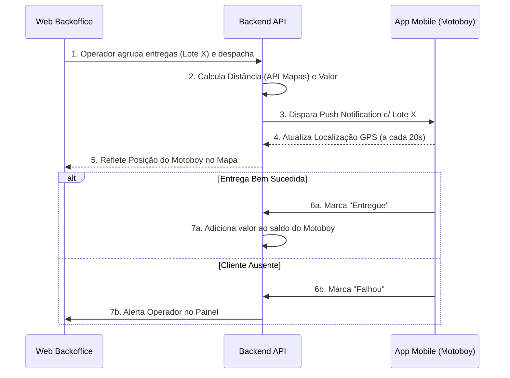
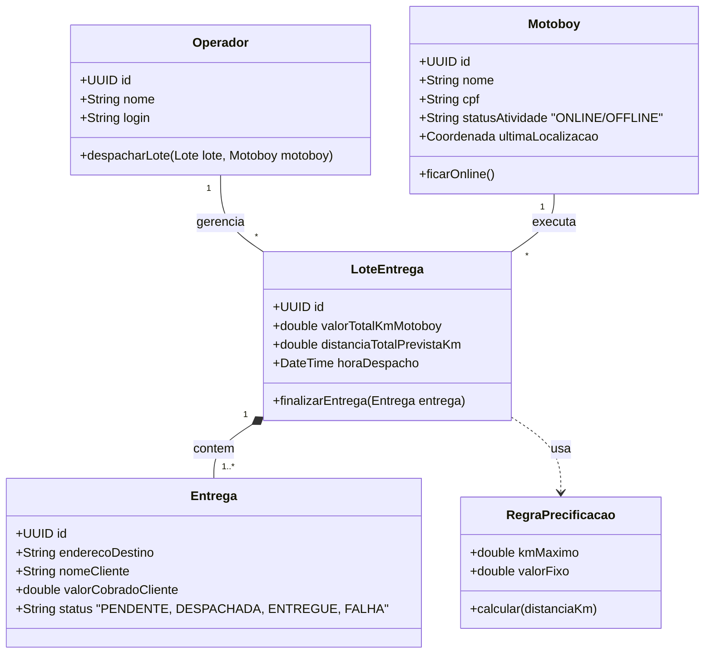
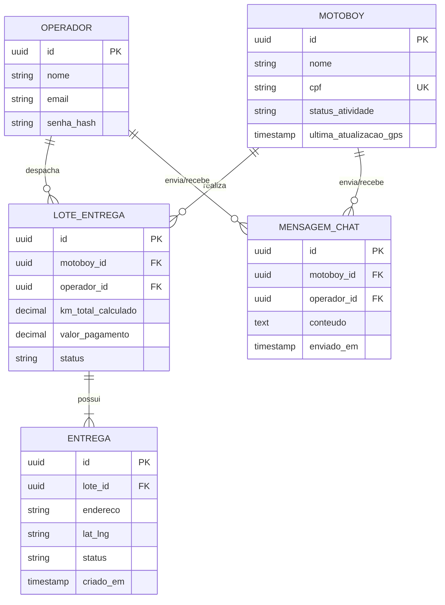

# PRD Completo - Plataforma "Agiliza Delivery" (BFF Web + Mobile Flutter)

---

## 1. Definição do Problema e Visão Geral

### 1.1 Declaração do Problema
O modelo tradicional de despacho de motoboys em restaurantes depende de roteirização mental e cálculos de quilometragem feitos à mão (ou em planilhas instáveis) ao fim do expediente. Isso causa:
*   **Atrasos logísticos:** Pedidos esfriando na estufa por falta de agrupamento inteligente de entregas próximas.
*   **Custos Ocultos e Atritos:** Divergências financeiras no acerto do motoboy devido a cálculos manuais baseados em "achismos" de distância.
*   **Falta de Visibilidade:** O gestor não sabe onde o motoboy está após ele sair para a entrega.

### 1.2 A Nova Solução
A plataforma "Agiliza Delivery" soluciona esse problema dividindo a operação em três frentes altamente integradas:
1.  **Backoffice (Backend Core):** Responsável pelas regras de negócio, tabelas de precificação, cálculo automático da primeira rota viável via API de mapas e consolidação financeira.
2.  **Frontend (Web BFF - Para Operadores):** Uma interface em tela cheia com mapa interativo onde o operador seleciona entregas visualmente, agrupa-as e as despacha.
3.  **App Mobile (Flutter - Para Motoboys):** App de uso compulsório (para a frota própria) que recebe rotas, atualiza a localização (tracking a cada ~20s) e permite interação via Chat Interno e botões de status rápido (Entregue / Falhou).

---

## 2. Personas e Cenários

*   **Persona 1: José (Gestor / Dono)**
    *   *Objetivo:* Cadastrar motoboys, definir regras de pagamento por faixa de KM e garantir precisão nos relatórios.
*   **Persona 2: Lucas (Operador de Despacho / Caixa)**
    *   *Objetivo:* Olhar o mapa, agrupar pedidos próximos com rapidez e despachar para motoboys ativos. Precisa de agilidade para não gerar fila de entrega.
*   **Persona 3: Rafael (Motoboy da Frota Própria)**
    *   *Objetivo:* Ligar o App, receber a rota (sem poder recusar), usar atalhos nativos para o Waze/WhatsApp e ter a certeza de que a KM correta será paga no fim da noite.

---

## 3. Requisitos Funcionais e Não Funcionais

### 3.1 Requisitos Funcionais (RF)
| ID | Descrição |
|---|---|
| RF-01 | O sistema deve permitir CRUD de Motoboys e Operadores. |
| RF-02 | O sistema deve permitir o cadastro de Tabela de Preços (ex: Até 2km = R$5,00; Até 5km = R$8,00). |
| RF-03 | O sistema web deve apresentar um mapa com "Pinos" numerados representando as entregas pendentes. |
| RF-04 | O operador deve conseguir selecionar múltiplos pinos (entregas) e realizar o agrupamento (Dispatch) para um Motoboy com status "Online". |
| RF-05 | O app Mobile não deve permitir que o motoboy recuse a rota atribuída. |
| RF-06 | O App Mobile deve enviar as coordenadas de GPS do motoboy para o Backend a cada 20 segundos (Tracking). |
| RF-07 | O Backend deve calcular a distância da entrega utilizando a *primeira rota de menor distância sugerida por uma API de Mapas* (Google/OSM), independentemente do caminho que o motoboy fizer na vida real. |
| RF-08 | O Motoboy deve poder mudar o status do pedido para "Entregue" ou "Falha (Não Atendeu)". |
| RF-09 | O sistema deve possuir um Módulo de Chat bidirecional entre Operador e Motoboy. |
| RF-10 | O sistema deve processar o fechamento financeiro, gerando o relatório final do motoboy no fim do turno e zerando seu saldo pendente. |

### 3.2 Requisitos Não Funcionais (RNF)
| ID | Descrição | Categoria |
|---|---|---|
| RNF-01 | O sistema deve atualizar as localizações dos motoboys no mapa Web com latência máxima de 30 segundos. | Performance / UX |
| RNF-02 | O Chat deve operar em tempo real (usando WebSockets). | Arquitetura |
| RNF-03 | O consumo de bateria e dados do App Mobile em background deve ser minimizado (atualização a cada 20s em vez de streaming contínuo). | Performance Mobile |

---

## 4. Épicos e Histórias de Usuário (BDD)

### Épico 1: Gestão Visual e Despacho
*   **US-1.1: Agrupamento Visual de Rotas**
    *   `Dado que` o Operador está na tela de Despacho
    *   `Quando` ele seleciona as entregas A, B e C no mapa e escolhe um Motoboy Online
    *   `Então` as três entregas viram um "Lote de Rota", somem do mapa de pendentes e são enviadas ao App do Motoboy selecionado.

### Épico 2: Operação de Campo (Flutter)
*   **US-2.1: Finalização ou Falha da Entrega**
    *   `Dado que` o Motoboy chegou ao destino
    *   `Quando` ele clica em "Falha na Entrega (Cliente Ausente)"
    *   `Então` o Backoffice é alertado imediatamente, a entrega ganha status "Devolvida" e a quilometragem daquela perna da rota é devidamente registrada (o motoboy foi até lá).

### Épico 3: Conciliação Financeira
*   **US-3.1: Cálculo de Pagamento Agnóstico de Rota Real**
    *   `Dado que` uma entrega foi finalizada
    *   `Quando` o sistema for consolidar o valor
    *   `Então` o sistema ignora o trajeto real do GPS do motoboy e utiliza a quilometragem consultada inicialmente na API de Mapas para garantir que ele ganhe pela rota ótima, não penalizando a empresa por desvios pessoais.

---

## 5. Diagramas Arquiteturais e de Requisitos

### 5.1 Diagrama de Fluxo / Comportamento (Flowchart)
*Mapeia o ciclo de vida completo de uma entrega.*

### 5.2 Diagrama de Classes UML (Core Domain)
*Visão orientada a objetos das principais entidades.*

### 5.3 Diagrama de Entidade Relacionamento (ERD)
*Visão para modelagem do Banco de Dados Relacional (PostgreSQL).*

