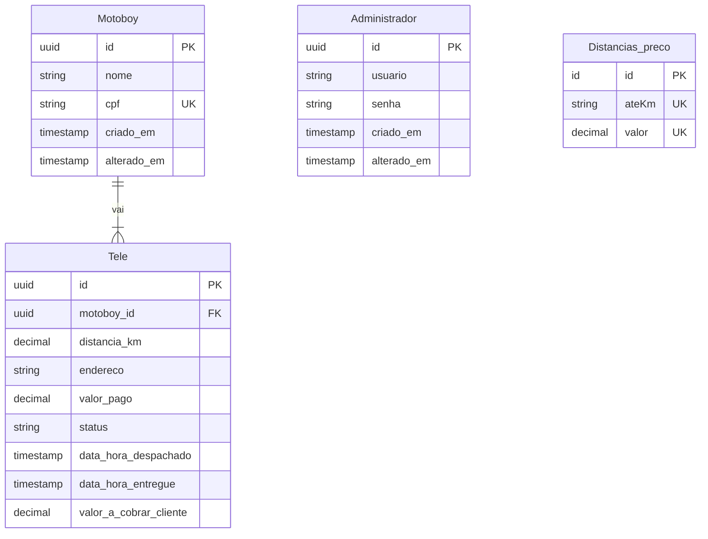
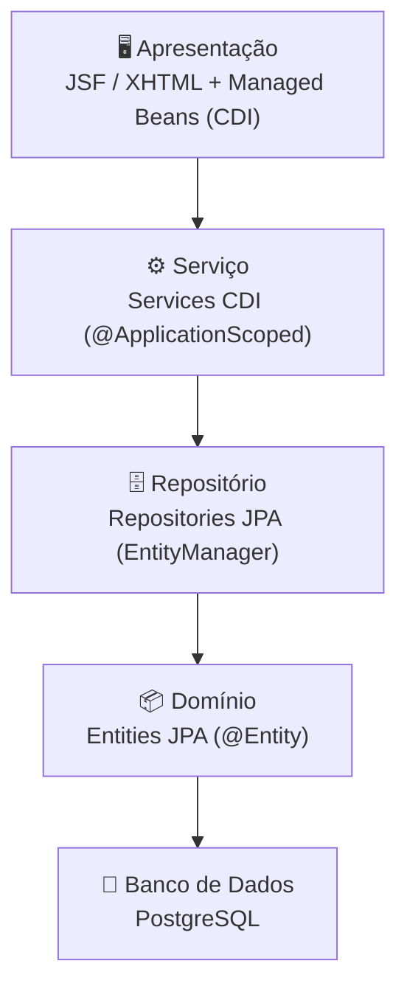

# PRD — Product Requirements Document


---

## Identificação

| Campo | Valor |
|---|---|
| **Nome do projeto** |  Gerenciamento de Motoboys e Otimização de Entregas |
| **Aluno** | Eduardo dos Santos de Camargo |
| **Versão do documento** | 1.0 |
| **Data de criação** | 14/05/2026 |
| **Última atualização** | 14/05/2026 |
| **Documento de Visão (ref.)** | `docs/visao.md` |

---

## 1. Objetivo do produto


O sistema é um gerenciador de motoboys e seus pagamentos, buscando automatizar geração de calculo de pagamentos e otimização de agrupamento de rotas
---

## 2. Personas


### Persona 1 — José

24 anos e gestor do delivery

- **Contexto:** É o dono ou responsavel pela área do delivery
- **Objetivo principal no sistema:** É quem irá cadastrar os motoboys e as taxas de de valores por quilometragem
- **Maior frustração atual (sem o sistema):** Perder muito tempo fazendo contas de quilometragem na mão no fim da noite e ver pedidos acumulando por falta de otimização no agrupamento das entregas.
- **Critério de sucesso:** Zero diferenças financeiras no acerto com os entregadores e redução de no tempo de espera da pizza na estufa aguardando despacho.


### Persona 3 — Rafael

24 anos e motoboy

- **Contexto:** é um dos motoboys do estabelecimento
- **Objetivo principal no sistema:** ele vai enviar as teles que ele irá e o app vai enviar para o sistema
- **Maior frustração atual (sem o sistema):** erros em calculos de pagamento que o afeta financeiramente
- **Critério de sucesso:** taxa de erro nos cálculos do pagamento perto de 0%


### Persona 2 — Lucas

22 anos e operador

- **Contexto:** é um dos operadores que realiza o fechamento dos motoboys
- **Objetivo principal no sistema:** verificar as teles, edita-las se necessário e emitir o recibo para pagamento dos motoboys
- **Maior frustração atual (sem o sistema):** ter que calcular manualmente as teles , usando planilhas que são instaveis.
- **Critério de sucesso:** redução de tempo para realizar pagamento

---

## 3. Requisitos funcionais


### 3.1 Gestão Financeira

| ID | Prioridade| Descrição | Persona |
|---|---|---|---|
| RF-001 | Alta | Cadastrar motoboys |José|
| RF-002 | Alta | Cadastrar valores e suas distâncias | José |
| RF-003 | Alta | Gerar cálculo do valores finais dos motoboys |Lucas|
| RF-004 | Alta| O sistema deve permitir que o administrador registre o fechamento, zerando o saldo pendente do motoboy|
| RF-005 | Média| Editar os valores e teles atribuidas aos motoboys|Lucas|
| RF-006 | Média| Gerar recibo| Lucas|
| RF-007 | Média| Armazenar todo o histórico de fechamento dos motoboys| Lucas|
| RF-008 | Baixa| Gerar relatórios sobre ganhos de motoboys e de distâncias | Lucas|


### 3.2 Otimização de Entregas

| ID | Prioridade| Descrição | Persona |
|---|---|---|---|
| RF-009 | Alta | Armazenar todos endereços já realizados e suas quantidades| |
| RF-010 | Alta | Armazenar diversas rotas para cada tele usando alguma API de mapas | |
| RF-011 | Alta | Armazenar rotas que o motoboy fez por meio do rastreamento do app | |
| RF-012 | Alta | Criar um algoritmo por meio de machine learning ou IA ou outra ferramenta que vai combinar melhores rotas para diversas teles| |
| RF-013 | Média| Armazenar diversas rotas para cada tele usando alguma API de mapas | |
| RF-014 | Baixa| Exibir o status da tele (em rota ou entregue)| Lucas|


---

## 4. Requisitos não funcionais

| ID | Categoria | Descrição | Critério de aceitação |
|---|---|---|---|
| RNF-001 | Desempenho |O tempo de resposta das chamadas de API não pode ultrapassar 3 segundos| Testes que comprovem que 90% das requisições retornam em 3 segundos |
| RNF-002 | Segurança | Dados de motoboys e senhas serão encriptografados antes de serem salvos no Banco de dados|Inspeção no Banco de dados nas colunas com dados sensíveis |
| RNF-003 | Usabilidade | A interface deve ser de fácil compreensão |
| RNF-004 | Manutenibilidade | O código deve seguir a arquiterura em camadas bem clara | Revisão de código dentro dos padrões |
| RNF-005 | Disponibilidade | O sistema deve estar sempre ativo 1 hora antes dos expedientes começarem, assim as manutenções deverão ocorrer em turno inverso | Monitoramento do servidor |

---

## 5. Regras de negócio


| ID | Regra |
|---|---|
| RN-001 | O motoboy só pode ter um cadastro ativo no sistema |
| RN-002 | O valor pago por entrega é calculado através de uma tabela base de quilometragem.|
| RN-003 | O saldo do motoboy só pode ser pago se não houver nenhuma entrega atribuída a ele com status pendente no dia atual|

---

## 6. Modelo de dados


### 6.1 Diagrama ER




### 6.2 Descrição das entidades

| Entidade | Responsabilidade | Principais atributos |
|---|---|---|
| Administrador| É quem vai cadastrar os motoboys e gerenciar as teles | usuario e senha|
| Motoboy |São os motoboys cadastrados nos sistemas, a eles serão atribuídos as teles | nome e cpf|
| Teles|É o ato completo da tele entrega|endereco , valor_pago, distancia_km |
Distancia_precos | é a tabela das distancias e seus respectivos valores, ex: até 2km é R$9,00| ateKm e valor

---

## 7. Arquitetura da solução

### 7.1 Visão em camadas




### 7.2 Estrutura de pacotes


```
src/main/
├── java/
│   └── br/edu/<projeto>/
│       ├── entity/        # Entidades JPA
│       ├── repository/    # Repositórios (acesso a dados)
│       ├── service/       # Regras de negócio (CDI)
│       ├── controller/    # Managed Beans (JSF)
│       └── rest/          # Endpoints REST (opcional)
├── resources/
│   └── META-INF/
│       └── persistence.xml
└── webapp/
    ├── WEB-INF/
    └── pages/             # Arquivos XHTML
```

### 7.3 Tecnologias e versões

| Tecnologia | Versão | Papel |
|---|---|---|
| Quarkus | | Servidor / runtime |
| Jakarta EE | | Plataforma |
| JSF / Faces | | Camada de visão |
| JPA + Hibernate | | Persistência |
| CDI | | Injeção de dependência |
| PostgreSQL | | Banco de dados |
| Maven | | Build |

---

## 8. Planejamento de sprints


| Sprint | Tema | Requisitos previstos | Entregáveis |
|---|---|---|---|
| Sprint 0 | Docs|  | visao.md |
| Sprint 1 | Docs|  | prd.md |
| Sprint 2 | Gestão Financeira | RF-001, RF-002 | Criação o entity de ambos, motoboy e distanciaPreco, seu repositório e seu service juntamente com o seu Bean e a sua View |
| Sprint 3 | Gestão Financeira |RF-001, RF-002 e RF-003 | Refatoração dos requisitos 1 e 2, e consumo da api do app para calcular valor das teles |
| Sprint 4 | Gestão Financeira|RF-001, RF-002 e RF-003  | Otimização do código criado, criação de Bean Validation e calculo das distâncias|
| Sprint 5 | | |  |

---

## 9. Critérios de aceite (MVP)


- [X] Cadastros dos motoboys 
- [X] Gerar valor para pagamento dos motoboys
- [ ] Algoritmo que entrega melhores combinações de rotas

---

## 10. Fora do escopo (explícito)


- Não haverá integração com gateway de pagamentos, não geraremos o pagamento para o motoboy , somente o recibo
- Não teremos contato com o os clientes, eles não poderão rastrear os motoboys


---

## 11. Histórico de revisões

| Versão | Data | Descrição |
|---|---|---|
| 1.0 |13/05 | Versão inicial |
| 1.5| 20/05 | Versão Final não revisada |
| 2.0| 21/05| Versão Final revisada|