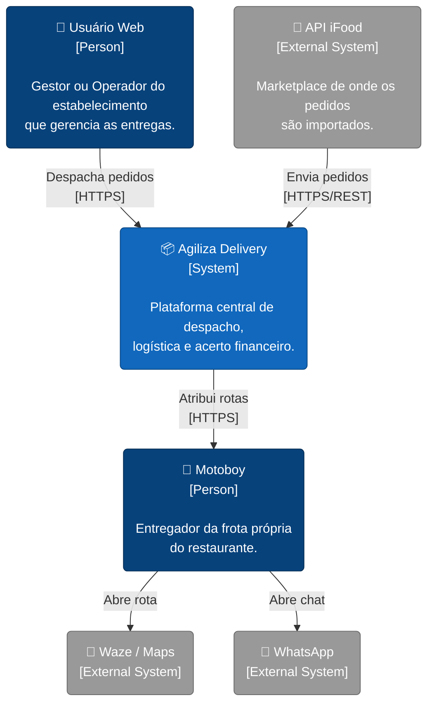
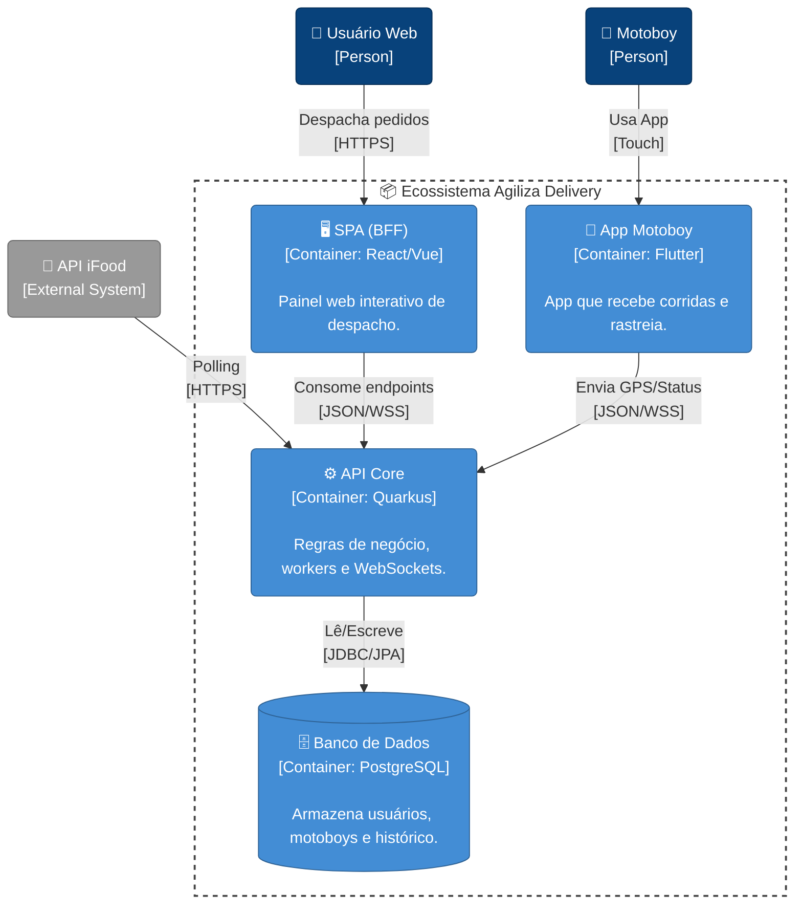

# Documentação Arquitetural (C4 Model) - Agiliza Delivery

Este documento detalha a arquitetura do ecossistema "Agiliza Delivery" utilizando a abordagem C4 Model, focando nos Níveis 1 (Contexto) e 2 (Container).

---

## Nível 1: Diagrama de Contexto
O diagrama de contexto mostra a visão de alto nível do sistema, identificando os atores (usuários) e os sistemas externos com os quais o Agiliza Delivery interage.

---

## Nível 2: Diagrama de Container
Este nível abre a caixa do "Agiliza Delivery" e detalha as tecnologias de software que compõem o sistema. O sistema foi dividido para respeitar as restrições arquiteturais (Backend Jakarta EE/Quarkus) e a separação de Frontends (SPA e Mobile).

---

## Resumo Arquitetural
* **Frontend Web:** Totalmente isolado do Backend. Consome a API Restful para desenhar o Mapa.
* **Aplicativo Mobile:** Consome a mesma API Restful que o Frontend Web.
* **Backend:** É a única ponte com o Banco de Dados. Ele gerencia o acesso simultâneo de múltiplos motoboys e faz o trabalho em *background* de puxar os dados do iFood a cada 30 segundos.
